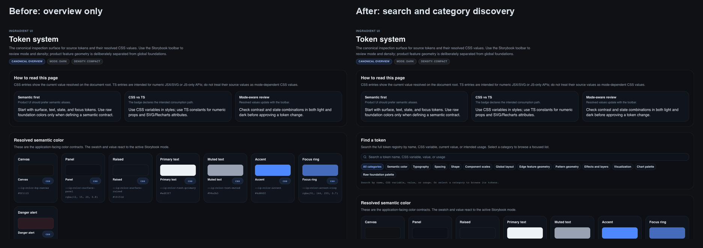
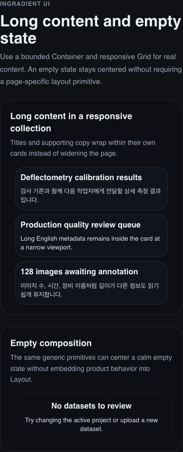
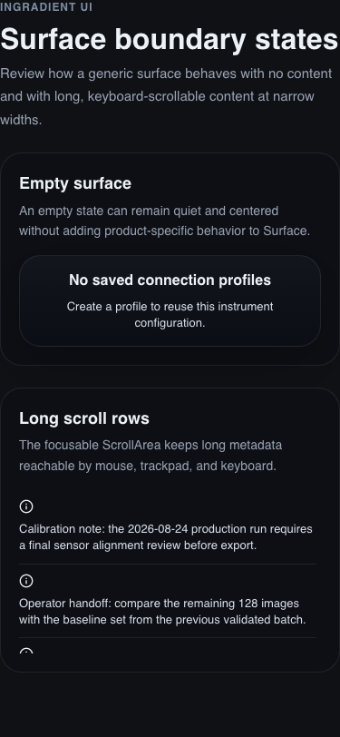
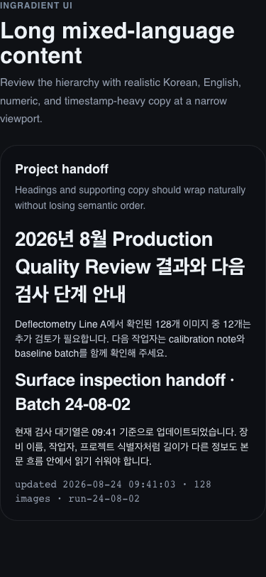
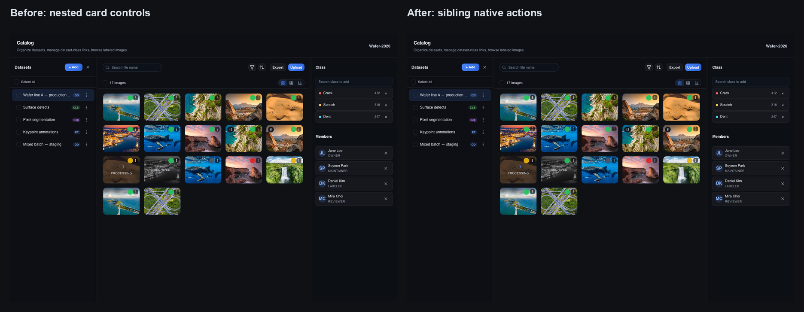
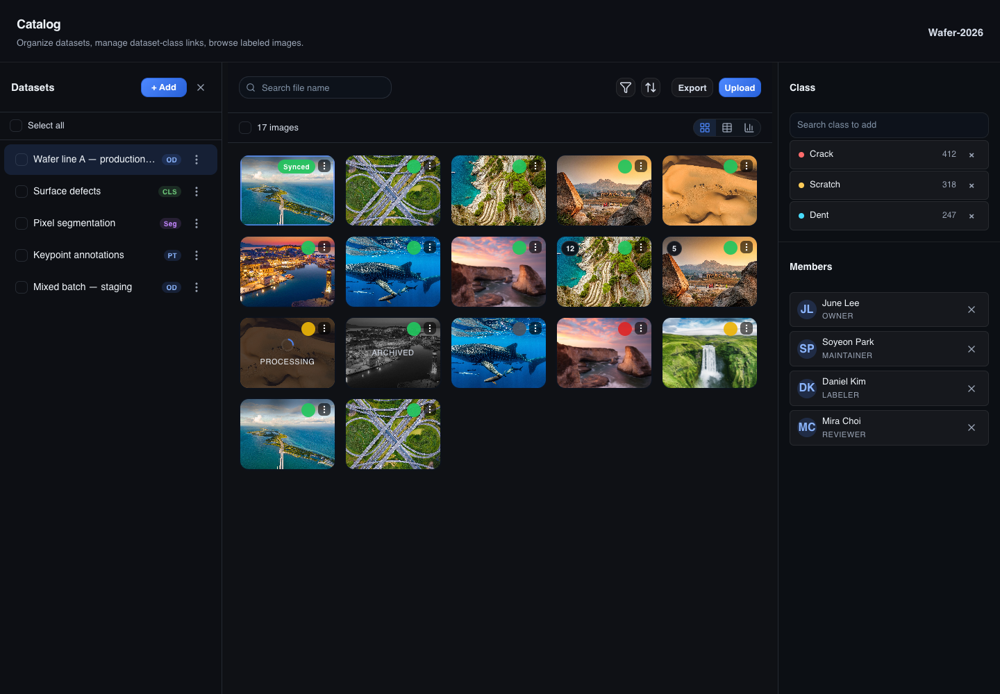
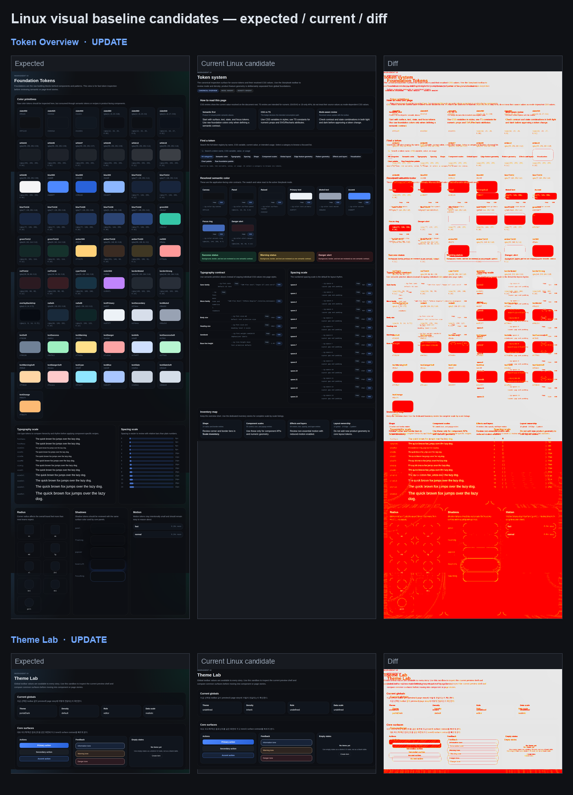
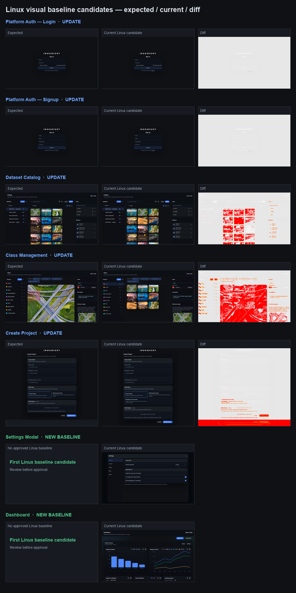
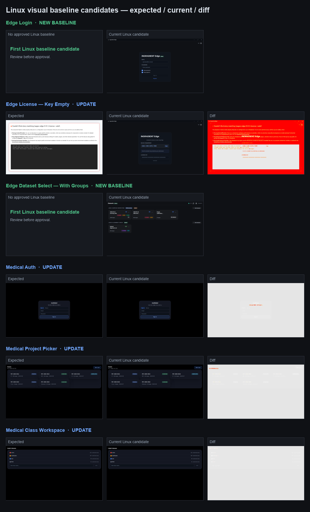

# 2026-09-02 디자인 시스템 탐색·접근성 기준선 복구 작업 리포트

> 상태: 접근성 기준선 복구 완료 · 전달 대상: [PR #15](https://github.com/InGradient/ingradient-ui/pull/15) · 이전 반영: PR #14 merge 완료 · 현재 상태: Storybook 213개 파일·506개 테스트 통과

## 1. 목적과 범위

이번 작업은 이전 리포트에서 다음 단계로 제안했던 항목을 순서대로 진행하는 데 목적이 있다.

포함한 범위는 다음과 같다.

1. 토큰 안내 화면의 정보 구조와 시각적 균형 재검토
2. 원하는 토큰을 빠르게 찾기 위한 검색과 범주 선택 기능 추가
3. 토큰 이름과 현재 값을 쉽게 복사하는 기능 추가
4. 기본 화면 구성 요소의 작은 화면, 긴 문구, 비어 있는 상태 예시 확장
5. 이미 기본 작업 공간에 반영된 이전 작업 공간과 가지의 안전한 정리
6. 기존 전체 Storybook 접근성 기준선 실패 40건의 원인 분류와 복구

새 제품 기능이나, 아직 기본 작업 공간에 반영되지 않은 별도 기능 작업은 범위에 포함하지 않았다.

## 2. 전달 결과

| 항목 | 결과 |
|---|---|
| 토큰 안내 화면의 시각 균형 | 개선 완료 |
| 토큰 검색 | 이름, 용도, 현재 값 기준 검색 가능 |
| 범주 선택 | 색상, 글자, 간격 등 범주별 확인 가능 |
| 토큰 복사 | 일반 화면과 검색 결과에서 상황에 맞게 제공 |
| 기본 화면 구성 요소 예시 | 긴 문구·비어 있는 상태·작은 화면 예시 추가 |
| 접근성 | 키보드 포커스와 자동 접근성 확인 통과 |
| 화면 확인 | 넓은 화면과 작은 화면에서 가로 잘림 없음 |
| 작업 공간 정리 | 안전한 네 개의 이전 작업 공간과 가지 제거 완료 |
| 검토 요청 | PR #14 생성 완료 |
| Storybook 접근성 기준선 | 실패 40건 → 실패 0건 |
| 전체 Storybook 브라우저 확인 | 213개 파일·506개 테스트 통과 |
| 패키지 소비자 확인 | 빌드 통과 |

## 3. 바로 확인할 링크

아래 링크를 사용하면 이번에 달라진 화면과 파일을 바로 확인할 수 있다. Storybook 링크는 이 컴퓨터에서 6006 미리보기 서버가 실행 중일 때 열 수 있다.

| 확인 대상 | 화면에서 확인 | 변경 파일 확인 |
|---|---|---|
| 전체 변경 비교 | [PR #14 전체 변경](https://github.com/InGradient/ingradient-ui/pull/14/files) | [PR #14](https://github.com/InGradient/ingradient-ui/pull/14) |
| Token Overview | [대표 안내 화면](http://localhost:6006/?path=/story/foundations-token-overview--overview) · [토큰 검색 전용 화면](http://localhost:6006/?path=/story/foundations-token-overview--token-discovery) | [안내 화면 구성](https://github.com/InGradient/ingradient-ui/blob/main/stories/foundations/token-overview.stories.tsx#L73-L172) · [검색·복사 동작](https://github.com/InGradient/ingradient-ui/blob/main/stories/foundations/token-overview/token-showcase.tsx#L75-L274) |
| Layout | [긴 문구·비어 있는 상태](http://localhost:6006/?path=/story/primitives-layout--long-content-and-empty) | [Layout 예시](https://github.com/InGradient/ingradient-ui/blob/main/src/primitives/layout/layout.stories.tsx#L53-L79) |
| Surfaces | [긴 스크롤·비어 있는 상태](http://localhost:6006/?path=/story/primitives-surfaces--boundary-states) | [Surface 예시](https://github.com/InGradient/ingradient-ui/blob/main/src/primitives/surfaces/surfaces.stories.tsx#L51-L75) |
| Typography | [긴 한국어·영어 혼합 문구](http://localhost:6006/?path=/story/primitives-typography--long-content) | [Typography 예시](https://github.com/InGradient/ingradient-ui/blob/main/src/primitives/typography/typography.stories.tsx#L82-L99) |
| Storybook 접근성 기준선 | [Catalog 검토 화면](http://localhost:6012/?path=/story/pages-platform-0-0-1-dataset-catalog-workspace--overview) · [ImageCard 키보드 예시](http://localhost:6012/?path=/story/components-data-display-imagecard--keyboard-activation) | [PR #15 전체 변경](https://github.com/InGradient/ingradient-ui/pull/15/files) |

### 3.1 Token Overview 전·후 비교

왼쪽은 검색과 범주 선택 기능을 넣기 전의 대표 화면이고, 오른쪽은 이번 작업 후의 화면이다. 새 찾기 영역이 색상 목록 앞에 추가되어, 화면을 훑는 흐름을 유지하면서도 필요한 토큰을 바로 찾을 수 있게 되었다.

## 4. 토큰 안내 화면의 시각 균형 개선

### 3.1 불필요한 빈 공간 정리

글자 기준 목록은 짧고 간격 목록은 길기 때문에, 두 영역이 같은 높이로 늘어나면서 글자 기준 영역 아래에 큰 빈 공간이 생기고 있었다.

이를 정리해 각 영역이 필요한 높이만 사용하도록 바꿨다. 이제 긴 목록은 긴 목록만의 공간을 사용하고, 짧은 목록은 불필요하게 비어 보이지 않는다.

### 3.2 색상 카드의 반복 정보 정리

색상 카드에는 카드 제목과 같은 이름이 내부에 한 번 더 표시되고 있었다.

중복 이름을 제거해, 카드에는 색상 모습·토큰 이름·현재 값처럼 실제 확인에 필요한 정보가 더 선명하게 보이도록 했다.

## 5. 토큰 검색과 범주 선택

### 4.1 검색 기능

토큰 안내 화면 상단에 찾기 영역을 추가했다.

다음 정보를 기준으로 원하는 토큰을 찾을 수 있다.

| 찾는 방식 | 예시 |
|---|---|
| 토큰 이름 | 강조색, 기본 글자색, 간격 등 |
| 사용 용도 | 버튼, 배경, 테두리, 화면 배치 등 |
| 현재 값 | 색상값, 글자 크기, 간격 수치 등 |
| 기술 이름 | 디자인 시스템 안에서 사용하는 고유 이름 |

검색 결과에는 해당 토큰이 어느 범주에 속하는지도 함께 표시된다.

### 4.2 범주 선택

검색어를 모를 때는 범주 버튼을 눌러 관련 토큰만 볼 수 있다.

포함된 범주는 다음과 같다.

- 의미 기반 색상
- 글자
- 간격
- 모서리와 테두리
- 입력 요소와 아이콘 크기
- 전체 화면 구조
- 현장 기능 전용 치수
- 효과와 화면 레이어
- 그래프와 이미지 표시 기준
- 원본 색상 목록

초기 화면은 불필요한 긴 목록을 열지 않고, 검색하거나 범주를 선택했을 때만 결과를 보여 준다.

## 6. 토큰 복사 기능

### 5.1 일반 안내 화면

일반 안내 화면에서는 각 항목에 복사 버튼 하나만 제공한다.

버튼을 누르면 토큰 이름과 현재 값을 함께 복사한다. 화면을 훑을 때 버튼이 너무 많아 복잡해지는 문제를 피하면서도, 필요한 정보를 한 번에 가져갈 수 있게 한 방식이다.

### 5.2 검색 결과 화면

검색 결과에서는 더 구체적인 작업을 할 수 있도록 두 종류의 복사를 제공한다.

- 토큰의 고유 이름만 복사
- 현재 적용된 값만 복사

복사가 완료되면 버튼 문구가 잠시 바뀌어 결과를 알린다. 실제 브라우저에서 이 완료 상태까지 확인했다.

## 7. 기본 화면 구성 요소 예시 확장

### 6.1 화면 배치

화면 배치 안내에 긴 제목과 긴 설명이 들어간 카드 모음을 추가했다.

작은 화면에서도 긴 한국어와 영어 문구가 카드 밖으로 밀려나지 않고 자연스럽게 다음 줄로 넘어가는지 확인할 수 있다.

비어 있는 상태도 함께 추가했다. 특정 제품 기능에 묶이지 않은 기본 배치 요소만으로, 비어 있는 상태를 차분하게 가운데에 둘 수 있음을 보여 준다.

### 6.2 배경과 카드

배경과 카드 안내에는 다음 두 상태를 추가했다.

| 상태 | 확인 목적 |
|---|---|
| 비어 있는 카드 | 내용이 없을 때에도 카드가 과도하게 비어 보이거나 흐트러지지 않는지 확인 |
| 긴 스크롤 목록 | 긴 안내 문구와 목록을 마우스·트랙패드·키보드로 모두 확인할 수 있는지 검토 |

스크롤 영역은 키보드로 이동할 수 있고, 이름이 있어 보조기술 사용자가 역할을 이해할 수 있다.

### 6.3 글자

글자 안내에는 실제 제품에 가까운 긴 한국어·영어·숫자·시간 정보가 섞인 예시를 추가했다.

이를 통해 작은 화면에서 다음 항목을 함께 검토할 수 있다.

- 긴 제목의 줄바꿈
- 본문 설명의 읽기 쉬운 정도
- 숫자와 시간 정보의 정렬
- 제목과 본문의 구조적 순서

## 8. 화면과 접근성 확인

다음 상태를 실제로 확인했다.

| 확인 항목 | 결과 |
|---|---|
| 토큰 안내 화면, 넓은 화면 | 가로 잘림 없음 |
| 토큰 안내 화면, 작은 화면 | 가로 잘림 없음 |
| 밝은 화면과 어두운 화면 | 색상과 현재 값이 정상 반영됨 |
| 토큰 검색과 범주 선택 | 정상 작동 |
| 토큰 복사 | 실제 브라우저에서 완료 상태 확인 |
| 긴 문구와 비어 있는 상태 예시 | 작은 화면에서 정상 표시 |
| 긴 스크롤 목록 | 키보드로 선택 가능 |
| 이번 변경의 자동 접근성 확인 | 통과 |
| 전체 기능 확인 | 통과 |
| 결과물 생성 확인 | 통과 |

초기 확인 당시 전체 Storybook 자동 확인에서는 이미 최신 기본 작업 공간에도 있던 접근성 실패 40건이 다시 나타났다. 이번 변경과 직접 관련된 Token Overview, Layout, Surfaces, Typography 화면은 원격 확인에서도 모두 통과했다. 이후 별도 기준선 복구 작업으로 40건 전체를 해결했으며, 결과는 이 리포트의 11절에 기록했다.

## 9. 작업 공간과 가지 정리

기본 작업 공간에 이미 반영된 이전 작업 공간을 점검했다.

### 8.1 안전하게 정리한 항목

다음 네 작업 공간은 이미 기본 작업 공간에 반영되어 있었고, 남아 있는 내용도 설치 파일이나 화면 확인 과정에서 만들어진 파일뿐이었다.

- 현장 화면 정리 작업 공간
- 안전 통합 작업 공간
- 접근성 문서화 작업 공간
- 이전 토큰 안내 화면 작업 공간

각 작업 공간과 연결된 로컬 가지를 제거했다. 원격의 이미 반영된 세 가지 작업 가지도 함께 정리했다.

### 8.2 보존한 항목

다음 두 작업 공간은 별도 파일 또는 설정 수정이 남아 있어 보존했다.

| 작업 공간 | 보존 이유 |
|---|---|
| 카탈로그 상호작용 작업 | 별도 버그 리포트 파일이 남아 있음 |
| Storybook 실험 작업 | 설정과 의존성 목록 수정이 남아 있음 |

현재 검토 요청을 올린 작업 공간도 아직 기본 작업 공간에 반영되지 않았으므로 보존했다.

## 10. 검토 요청 상태

이번 변경은 별도 검토 요청으로 올렸다.

| 항목 | 내용 |
|---|---|
| 검토 요청 | PR #14 |
| 주소 | https://github.com/InGradient/ingradient-ui/pull/14 |
| 상태 | merge 완료 · 기본 미리보기 화면 최신 상태 확인 |
| 포함 내용 | 토큰 탐색·복사·시각 개선과 기본 화면 구성 요소 예시 확장 |

## 11. Storybook 접근성 기준선 복구

### 11.1 원인과 범위

전체 Storybook 자동 확인에서 16개 파일, 40개 화면이 접근성 오류로 실패하고 있었다. 이 중 30건은 Catalog 이미지 카드 하나의 공통 구조에서 발생했다. 카드 전체를 버튼처럼 만들면서, 내부에 별도 메뉴 버튼과 상태 칩을 넣어 클릭 가능한 요소가 중첩되어 있던 것이 원인이었다.

나머지 10건은 스크롤 영역의 키보드 접근, 중복된 페이지 이동 영역 이름, 건너뛴 제목 단계, 입력 요소 이름, 잘못된 텍스트 영역 역할처럼 재사용 컴포넌트의 작은 계약 문제였다.

현재 검토용 화면: [Catalog 작업 공간](http://localhost:6012/?path=/story/pages-platform-0-0-1-dataset-catalog-workspace--overview) · [ImageCard 접근성 예시](http://localhost:6012/?path=/story/components-data-display-imagecard--keyboard-activation)

검토 요청: [PR #15 — Storybook 접근성 기준선 복구](https://github.com/InGradient/ingradient-ui/pull/15)

| 원인 | 해결 방식 |
|---|---|
| 이미지 카드 안의 중첩 클릭 요소 | 카드의 시각적 틀은 유지하고, 이미지 열기와 메뉴를 서로 형제인 기본 버튼으로 분리 |
| 긴 스크롤 영역 | 키보드로 이동할 수 있도록 포커스 대상 추가 |
| 같은 이름의 페이지 이동 영역 | 화면별로 구분되는 이름을 받을 수 있도록 확장 |
| 제목 단계 건너뜀 | 화면 구조에 맞는 제목 단계로 조정하되 글자 크기는 유지 |
| 이름 없는 입력·목록·촬영 버튼 | 화면에서 하는 일을 읽을 수 있는 이름 추가 |
| smoke consumer 빌드 | 엄격한 타입 검사에서 막히던 기존 미사용 import 다섯 개 제거 |

### 11.2 Catalog 이미지 카드 전·후 비교

왼쪽은 카드 전체가 하나의 가상 버튼이면서 내부 메뉴 버튼을 품고 있던 이전 구조다. 오른쪽은 화면 모양을 바꾸지 않고 이미지 열기 버튼과 메뉴 버튼을 나란히 분리한 이후의 상태다. 따라서 마우스 동작과 카드의 정보 배치는 유지하면서도 키보드와 보조기술이 각각의 동작을 분명하게 이해할 수 있다.

### 11.3 새 키보드 포커스 상태

이미지 열기 동작에 키보드 포커스가 오면 카드 안쪽에 포커스 윤곽이 보이고, 접혀 있던 동기화 상태도 전체 문구로 펼쳐진다. 메뉴 버튼은 이미지 열기 버튼 안에 포함되지 않아 별도의 다음 키보드 이동 대상이 된다.

### 11.4 확인 결과

| 확인 항목 | 결과 |
|---|---|
| 기존 접근성 실패 | 40건 → 0건 |
| 전체 Storybook 브라우저 확인 | 213개 파일·506개 테스트 통과 |
| 단위 테스트 | 66개 파일·317개 테스트 통과 |
| 타입 검사 | 통과 |
| 패키지 빌드 | 통과 |
| 소비자 애플리케이션 빌드 | 통과 |
| 스타일·문서 검사 | 통과 |
| Catalog 넓은 화면 | 가로 잘림 없음, 기존 화면 배치 유지 |
| Catalog 카드 구조 | 카드 역할 0개, 이미지 열기 버튼 17개, 메뉴 버튼 17개 확인 |

원격 PR 확인에서도 lint·타입 검사·단위 테스트·Storybook 브라우저 테스트·패키지/소비자/정적 Storybook 빌드까지 통과했다. 마지막 visual snapshot 단계에서는 기존 Linux 기준 이미지 부채가 드러났고, 이를 [별도 Draft Visual PR #16](https://github.com/InGradient/ingradient-ui/pull/16)에서 검토하기로 분리했다. [PR #15의 CI 설명](https://github.com/InGradient/ingradient-ui/pull/15#issuecomment-5519093712)을 참조한다.

전체 확인 중 기존 경고는 남아 있지만, 실패로 이어지는 접근성 오류는 없었다. 예를 들어 일부 오래된 Storybook 예시의 DOM 중첩 및 읽기 전용 입력 경고는 이번 접근성 기준선 실패와 별개이므로 범위를 넓혀 수정하지 않았다.

## 12. Linux visual baseline 정비 — 승인 대기

### 12.1 분리한 이유와 현재 상태

PR #15가 처음으로 Storybook 접근성 단계를 통과하면서, 그 뒤에 가려져 있던 Linux visual snapshot 부채가 노출됐다. 이 작업은 디자인 변경을 섞지 않고, 정확한 현재 Story 계약과 Linux 기준 이미지를 별도 검토하기 위해 Draft PR #16으로 분리했다.

[PR #16](https://github.com/InGradient/ingradient-ui/pull/16)은 PR #15의 접근성 커밋을 부모로 둔 stacked PR이다. 저장소의 CI가 `main` 대상 PR에서만 실행되므로 현재는 두 커밋을 함께 보지만, PR #15가 merge되면 visual 정비 변경만 남는다.

| 정리 항목 | 결과 |
|---|---|
| 삭제된 Story target | `patterns-shell-and-layouts`, `pages-table-page` 두 개 제거 및 오래된 Linux 이미지 제거 |
| 현재 Story readiness | Token Overview, Edge Login, Edge Dataset Select, Edge License를 실제 Story ID·제목으로 조정 |
| 오류 화면 오인 방지 | 존재하지 않는 Story가 Storybook 오류 화면으로 열리면 snapshot 전에 명시적으로 실패하도록 보호 |
| Linux 결과 보존 | 실패 시 `test-results`와 Playwright report를 7일 artifact로 보관 |
| 현재 visual 대상 | 17개 → 15개. 현재 제품에 존재하는 대표 화면만 유지 |

원격 실행 [33707910478](https://github.com/InGradient/ingradient-ui/actions/runs/33707910478)은 visual 단계 전의 모든 CI 단계를 통과했고, Linux candidate 이미지 artifact를 정상 업로드했다. snapshot 파일은 아직 변경하지 않았다.

### 12.2 Linux 후보 이미지 비교

아래 이미지는 macOS 캡처가 아니라 GitHub Actions의 Linux Chromium이 만든 후보다. 기존 기준 이미지가 있는 화면은 **Expected / Current / Diff** 순으로, 기준이 없던 화면은 **첫 Linux baseline 후보**로 표시했다.

### 12.3 승인 범위

| 종류 | 화면 수 | 다음 단계 |
|---|---:|---|
| 기존 기준을 현재 화면으로 갱신 | 11 | 후보와 비교 후 승인 시 Linux actual을 새 기준 이미지로 반영 |
| 새 Linux 기준 생성 | 4 | Edge Login, Edge Dataset Select, Settings Modal, Dashboard의 첫 기준 이미지 승인 |
| 제거 | 2 | 이미 삭제된 Story의 기준 이미지 제거 완료 |

특히 Edge License의 이전 “기준” 이미지는 실제 License 화면이 아니라 삭제된 `--valid` Story ID의 Storybook 오류 화면이었다. 새 `Key Empty` 후보는 정상 License 화면이므로, 오류 화면을 기준으로 보존하지 않고 명시적인 승인 후 교체한다.

## 13. 다음 확인 항목

1. Token Overview의 정보량과 복사 방식에 대한 실제 화면 피드백 반영
2. 보존한 두 작업 공간의 별도 파일과 설정 수정 내용을 나중에 검토
3. 12절의 Linux visual 후보를 검토하고 승인된 snapshot만 PR #16에 반영

## 14. 결론

이번 작업으로 토큰 안내 화면은 단순한 목록이 아니라, 필요한 기준을 찾고 확인하고 가져갈 수 있는 실용적인 검토 화면이 되었다.

또한 기본 화면 구성 요소 안내에 작은 화면, 긴 문구, 비어 있는 상태를 추가해 실제 제품 화면에서 자주 발생하는 경계 상황을 더 쉽게 검토할 수 있게 했다.

완료된 이전 작업 공간은 안전하게 줄였고, 별도 검토가 필요한 작업은 보존해 기존 작업을 잃지 않도록 했다.

추가로, 전체 Storybook 접근성 기준선의 40개 실패를 모두 복구했다. 특히 화면 모양을 바꾸지 않고 이미지 카드의 클릭 구조를 바로잡아 Catalog 전반의 접근성 오류를 한 번에 제거했다. 이후 변경은 전체 브라우저 테스트와 소비자 애플리케이션 빌드까지 통과해, 다시 신뢰할 수 있는 자동 확인 기준을 제공한다.
