# 2026년 9월 8일 작업 리포트

**오늘의 결과:** UI 패키지의 화면·배포 문제를 정리하고 실제 Platform에 연결했다. 최신 main과 통합한 뒤 UI 단위 테스트 317개와 실제 로컬 서버 브라우저 검사 23개를 통과했으며, 두 저장소를 push했다. 최종 모바일 화면에서는 하단 메뉴 잘림을 발견해 미해결 항목으로 남겼다.

이 리포트는 **오늘 수정·통합·검증한 작업만** 다룬다. 이전에 만든 토큰 검색·복사 기능과 접근성 개선은 오늘 재검증하고 통합한 내용이며, 오늘 새로 개발한 기능으로 계산하지 않는다.

이미지는 세 종류로 구분했다. **수정 전후**는 같은 화면의 수정 비교, **동작 상태 비교**는 검증 중 입력·조작에 따른 변화, **병합 전후**는 오늘 초기 체크아웃과 최신 main 통합본의 차이다. 수치 비교 그림은 실제 로그를 정리한 도표이며 제품 화면 캡처가 아니다. 모든 화면 캡처는 원본을 그대로 보존했다.

## 작업 목록

| 번호 | 오늘 한 일 | 상태 | 비교 자료 |
|---|---|---|---|
| 1 | Token Overview의 긴 글꼴 값과 설명 열 배치 수정 | 완료 | Linux 수정 전후 |
| 2 | Theme Lab 설정값 표시 수정, Linux 화면 기준 정비 | 완료 | Linux 수정 전후 |
| 3 | UI 공개 경로·타입·패키지 구성 수정, 중복 용량 축소 | 완료 | 변경 전후 수치 도표 |
| 4 | 별도 설치 앱에서 Platform·Edge 동작 확인 | 검증 완료 | Edge 입력 전후 상태 |
| 5 | 실제 Platform 연결 오류 수정, 최신 구조와 통합 | 완료 | 빌드 결과·카탈로그 병합 전후 |
| 6 | 업로드 연결 복구, 실제 데이터 흐름 회귀 검증 | 완료 | 목록·상세 결과 화면 |
| 7 | 모바일 화면의 남은 잘림 문제 확인 | **미해결** | 초기·최종 모바일 비교 |
| 8 | 남아 있던 작업 커밋, main 병합·push | 완료 | 저장소별 전달 상태 |

## 1. Token Overview — 글꼴 값 때문에 설명이 찌그러지는 문제 수정

**작업 전:** 글꼴 이름이 길어지면 같은 행의 토큰 이름과 용도 설명에 남는 폭이 줄었다. 특히 `Mono family` 행에서 설명이 작은 조각으로 여러 줄에 나뉘었다.

**오늘 수정한 내용**

- 이름·설명·값을 놓는 열의 비율을 조정하고, 긴 값이 필요한 만큼 줄바꿈되도록 수정했다.
- 좁은 화면에서는 정보를 세로로 읽을 수 있는 배치로 전환했다.
- 375·768·1280 폭에서 확인하고, 기존 검색·복사 동작도 다시 확인했다.
- 수정된 Linux 실제 캡처를 기준 이미지에 반영했다.

**결과:** 설명 열의 과도한 줄바꿈을 줄이고 긴 글꼴 값도 읽을 수 있게 됐다. 검색·복사 기능의 신규 개발은 이전 작업이고, 오늘은 배치 수정과 재검증을 했다.

| 수정 전 — 설명 열이 지나치게 좁음 | 수정 후 — 설명과 값이 각 열 안에서 줄바꿈 |
|---|---|
| 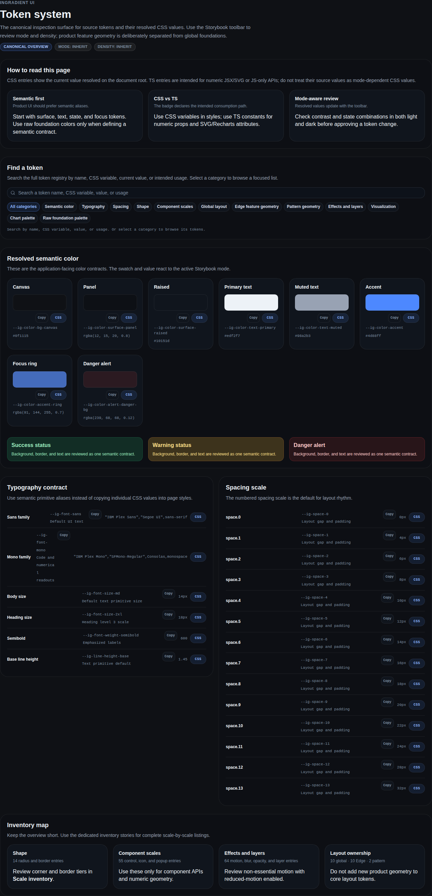 | 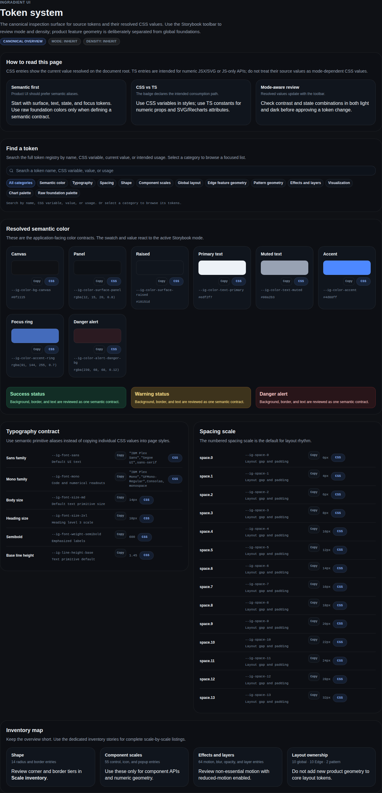 |

**볼 곳:** 두 이미지의 중하단 `Typography contract`, 특히 `Sans family`와 `Mono family` 행. 두 이미지는 모두 Linux Chromium의 1280px 폭 캡처다. [전 원본](assets/2026-09-08-daily/token-before.png) · [후 원본](assets/2026-09-08-daily/token-after.png)

주요 파일: `stories/foundations/token-overview/token-showcase.tsx`.

## 2. Theme Lab — 잘못된 설정값 표시와 Linux 화면 기준 수정

**작업 전:** 현재는 쓰지 않는 설정 이름을 읽어 `Theme`, `Role`, `Data scale`에 `undefined`가 표시됐다. 화면 검토자가 어떤 설정이 적용됐는지 알기 어려웠다.

**오늘 수정한 내용**

- 실제 설정인 `Mode`, `Density`, `Locale`, `Inspector`를 표시하도록 바꿨다.
- Linux 대표 화면 15개를 검토했다.
- Theme Lab과 Token Overview 두 화면을 수정한 Linux 캡처로 갱신했다. 나머지 13개는 해당 실행에서 일치했다.
- 이전 접근성 변경과 화면 기준 변경을 순서대로 main에 통합했다.

**결과:** 설정 영역이 실제 값인 `inherit`, `inherit`, `ko`, `off`를 표시한다. macOS 캡처를 Linux 기준으로 대체하지 않았다.

| 수정 전 — 3개 항목이 `undefined` | 수정 후 — 실제 설정 이름과 값 |
|---|---|
| 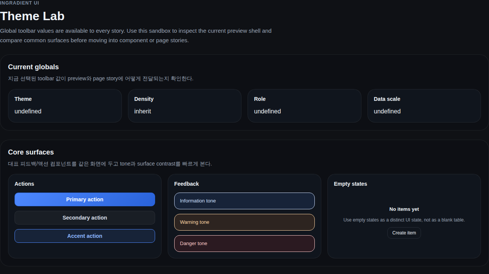 | 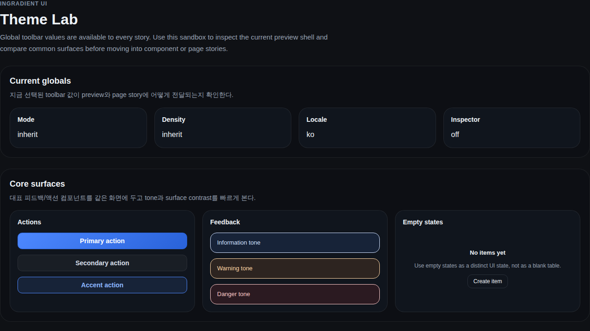 |

**볼 곳:** 상단 `Current globals`의 네 카드. 버튼·알림·빈 상태 예시는 유지됐다. 두 이미지는 같은 1280×720 Linux 화면이다.

주요 파일: `stories/sandboxes/theme-lab.stories.tsx`. 원본 실행: [수정된 Linux 이미지 생성 기록](https://github.com/InGradient/ingradient-ui/actions/runs/34283818126). 실행 결과는 오늘 보존한 기록을 인용했다.

## 3. UI 패키지 — 외부 앱에서 올바르게 설치되도록 수정

**작업 전:** 공통 동작을 가져오는 `hooks` 경로의 빌드 산출물이 빠져 있었다. 공개 경로 검사도 조건별 설정을 잘못 읽고 예전 경로에서 기능을 찾았다. 오래된 자기 패키지 압축 파일에 의존하는 구성과 중복 코드도 있었다.

**오늘 수정한 내용**

- `hooks` 실행 파일과 타입 선언 파일을 빌드하도록 추가했다.
- 공개 경로가 실제 파일과 필요한 기능을 제공하는지 검사하도록 수정했다.
- 오래된 자기 패키지 의존성을 제거하고 개발 중에는 현재 저장소를 연결하도록 정리했다.
- 공통 코드를 공유하도록 빌드 구성을 바꿨다.
- 스타일 파일의 유지 조건과 두 화면 패키지의 타입·가져오기 경로를 명시했다.
- 새 패키지 세 개를 외부 앱에 설치하는 검증을 CI·release 과정에 추가했다.

| 비교 항목 | 수정 전 | 수정 후 |
|---|---|---|
| 공통 동작 경로 | `hooks` 산출물 누락 | 실행 파일·타입 선언 생성 |
| 공개 경로 검사 | 설정 해석 오류·예전 경로 참조 | UI 9개 + 화면 패키지 각 1개 경로 검사 통과 |
| 루트 UI JavaScript 합계 | 1,074.1KB | 497.1KB |
| 기존 용량 제한 | 500KB 초과 | 500KB 이내 |
| 외부 앱 설치 | 오래된 연결에 의존할 위험 | 새 압축 패키지로 타입 검사·빌드 통과 |

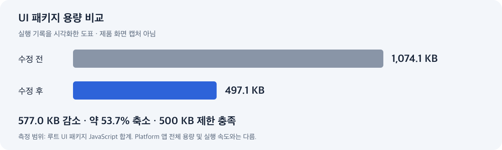

**도표 의미:** 루트 UI 패키지의 JavaScript 합계가 577.0KB, 약 53.7% 줄었다. Platform 앱 전체의 다운로드 용량이나 실행 속도를 측정한 수치는 아니다.

주요 파일: `scripts/check-exports.mjs`, `scripts/check-packed-consumer.mjs`, 패키지 빌드 설정과 각 `package.json`. [공개 경로 검사 전](assets/2026-09-08-daily/exports-before.log) · [검사 후](assets/2026-09-08-daily/exports-after.log) · [용량 로그](assets/2026-09-08-daily/package-size.log)

## 4. 별도 설치 앱 — Platform·Edge 화면의 실제 반응 확인

**오늘 검증한 내용:** UI 저장소 밖의 앱에 새 패키지 세 개를 설치한 뒤, Platform 로그인 입력과 로그인·가입 이벤트 전달을 확인했다. Edge에서는 빈 라이선스 키의 실행 차단, 키 입력 후 활성화 이벤트, 테스트 장비 식별값 복사를 확인했다.

**결과:** 저장소 안의 예시 화면뿐 아니라 별도로 설치한 패키지에서도 입력과 이벤트 전달이 동작했다.

| 동작 전 — 라이선스 키가 비어 있음 | 입력 후 — `Activate` 활성화 |
|---|---|
| 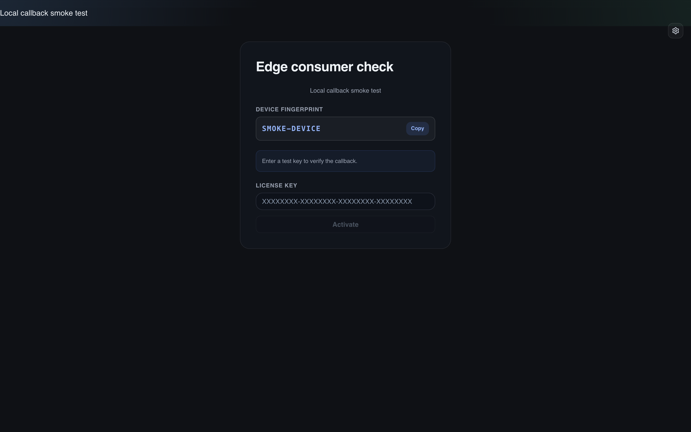 | 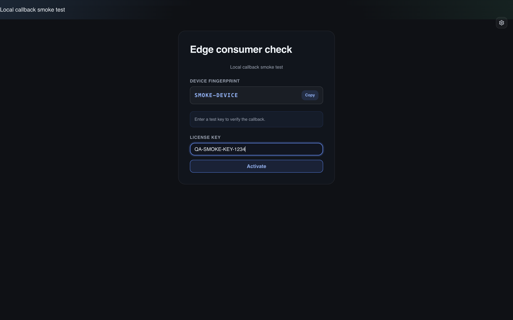 |

**볼 곳:** `LICENSE KEY` 입력칸과 아래 `Activate` 버튼. 이는 수정 전후 디자인 비교가 아니라 **오늘 검증한 입력 상태 비교**다. 화면의 키·장비 값은 테스트용이다.

**검증 한계:** 이벤트 전달 성공은 실제 라이선스 서버의 승인이나 장비 연결 성공을 의미하지 않는다. 실제 Edge 앱·장비 연동은 확인하지 못했다.

## 5. 실제 Platform — 패키지 연결 오류 수정과 최신 main 통합

**작업 전:** 실제 Platform이 예전 UI 경로에서 기능을 가져와 빌드가 25개 TypeScript 오류로 실패했다. 초기 연결 수정을 마친 뒤에는 최신 원격 main에 117개 추가 커밋이 있는 것도 확인했다.

**오늘 수정한 내용**

- `CheckboxGroup`, `DrawingLayer`, `CommentThread` 등 조합 요소는 `/patterns`로 연결했다.
- 선택·실행 취소·그리기 관련 기능과 타입은 `/hooks`로 연결했다.
- 예전 로딩·오류 표현을 현재 제공되는 상태 표시 요소로 교체했다.
- Vite에서 UI 소스나 개별 빌드 파일을 직접 가리키던 연결을 제거하고 패키지 공개 경로를 사용했다.
- 최신 `app / modules / shared` 구조를 유지하면서 변경을 통합했다. 이미 삭제된 오래된 파일을 되살리지 않았다.
- 최신 카탈로그가 사용하는 대화상자와 업로드 품질 타입을 UI 패키지에서 공개했다.

**결과:** 최종 Platform 타입 검사와 배포용 빌드가 통과했다. 초기 오류 25개는 수정 전 로그의 수치이고, 최종 성공은 병합 후 로그 기준이다.

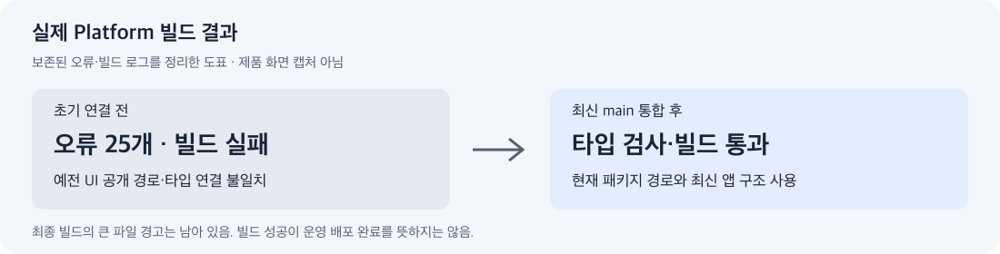

| 오늘 초기 연결 완료 화면 — 이전 체크아웃 | 오늘 최종 병합 화면 — 최신 main 구조 |
|---|---|
| 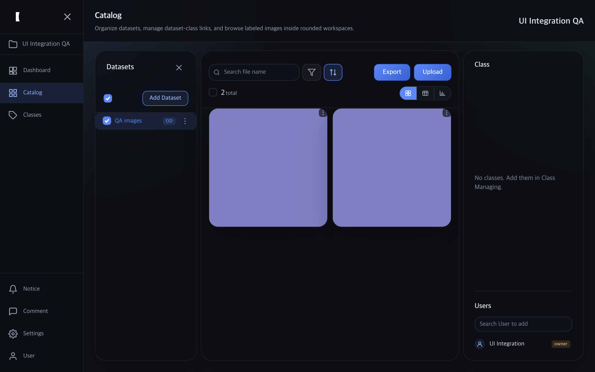 | 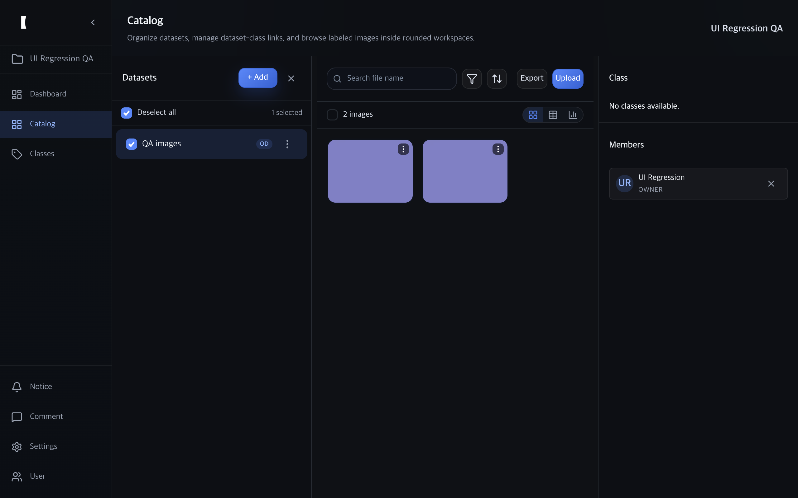 |

**볼 곳:** 데이터셋의 추가 버튼·선택 표시, 이미지 카드 크기, 오른쪽 멤버 영역. 두 화면은 모두 1280×800 CSS 픽셀이다. 테스트 프로젝트 이름은 실행마다 다르다.

**비교 해석:** 왼쪽도 초기 연결 오류를 고친 뒤 촬영한 화면이다. 오류 상태의 제품 화면 캡처는 없다. 오른쪽과의 시각적 차이에는 원격 main에 이미 있던 변경이 포함되므로, 전부 오늘 새로 디자인한 결과로 해석하면 안 된다.

주요 파일: `frontend/vite.config.ts`, 현재 `frontend/modules/gallery`의 이미지 상세 관련 파일, UI의 `packages/platform-pages/src/catalog/index.ts`. [수정 전 빌드 로그](assets/2026-09-08-daily/platform-build-before.log) · [최종 빌드 로그](assets/2026-09-08-daily/platform-build-after.log)

## 6. 실제 데이터 흐름 — 업로드 연결 복구와 23개 회귀 검증

**발견한 문제:** 최신 카탈로그의 업로드 버튼은 파일 입력을 참조하고 있었지만 실제 파일 입력 요소가 페이지에 연결되지 않아 업로드 흐름을 시작할 수 없었다.

**오늘 수정한 내용**

- 페이지에 실제 파일 입력을 연결하고 기존 파일 변경 처리 함수를 사용하도록 복구했다.
- 데스크톱과 모바일에 필요한 화면 정보를 구분해 전달했다.
- 실제 로컬 FastAPI 서버와 새 SQLite 데이터베이스를 사용하는 반복 가능한 브라우저 검증을 정리했다.
- 최신 화면의 버튼 이름과 역할에 맞춰 검증을 조정하고, 증거 촬영 전에 브라우저 계정 저장 안내를 닫도록 보완했다.

**오늘 확인한 동작**

| 흐름 | 확인 결과 |
|---|---|
| 가입·인증 | 가입 정보 저장, 잘못된 비밀번호 거절, 정상 로그인 |
| 프로젝트·데이터셋 | 생성 후 저장 |
| 업로드 | 품질 선택창 표시, 이미지 2개 업로드, 목록에 표시 |
| 검색·정렬 | 검색 결과 필터링과 복원, 파일 이름 역순 정렬 |
| 선택 | 전체 선택과 선택 해제 |
| 이미지 상세 | 상세 열기, 확대·축소 반응 |
| 댓글 | 댓글 저장 후 화면 표시 |
| 대화상자 | 데이터셋 추가 창 열기, Escape로 닫기 |

| 검증 결과 A — 업로드된 이미지 2개 | 검증 결과 B — 상세 화면·확대·저장된 댓글 |
|---|---|
|  | 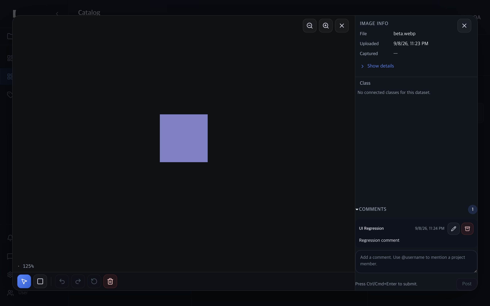 |

**볼 곳:** 왼쪽 `2 images`와 두 카드, 오른쪽의 파일명·125% 확대 표시·댓글 `Regression comment`. 보라색 사각형은 실제 업로드한 단색 테스트 이미지이며, 로딩 중 표시가 아니다. 이 두 장은 같은 기능의 디자인 전후가 아니라 **업로드 이후의 사용 흐름을 보여 주는 결과 화면**이다.

**결과:** 최종 파일에서 23개 체크포인트 통과. 자동 검사에는 기본 모바일 표시도 포함되지만, 아래 하단 메뉴 문제까지 검사한 것은 아니다.

주요 파일: `frontend/pages/CatalogPage.tsx`, `frontend/modules/catalog/state/use-catalog-page-scene.tsx`, `scripts/test-ui-integration.mjs`. [최종 23개 검사 로그](assets/2026-09-08-daily/browser-regression-final.log)

운영 서버·운영 데이터는 이 검증에 사용하지 않았다. 도형 편집·실행 취소의 저장 흐름과 클래스 연계 데이터셋 선택은 이번 집중 검증 범위 밖이다.

## 7. 모바일 — 최종 화면에서 남은 문제를 확인

**오늘 확인한 내용:** 최종 375×812 화면에서 카탈로그 하단 도구 모음이 보이지 않았다. 화면 전체 높이를 사용하는 카탈로그와 상단 여백 52px을 더하는 앱 구조가 결합되고, 넘치는 영역을 숨기는 설정 때문에 메뉴가 화면 밖으로 밀리는 것으로 검토됐다.

| 오늘 초기 체크아웃 — 이미지 위에 도구 모음 표시 | 오늘 최종 병합본 — 도구 모음이 화면에서 보이지 않음 |
|---|---|
| 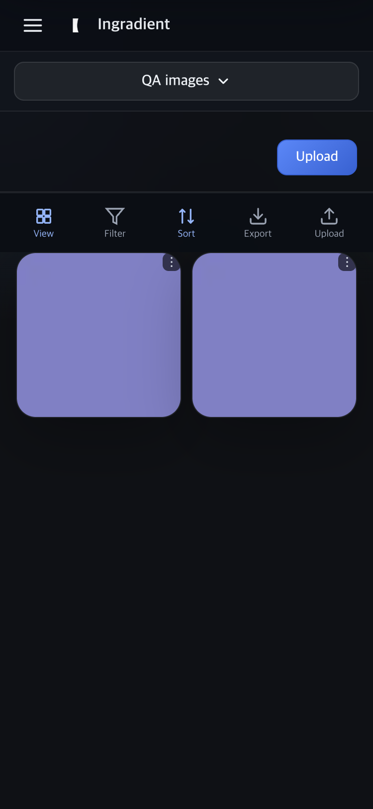 | 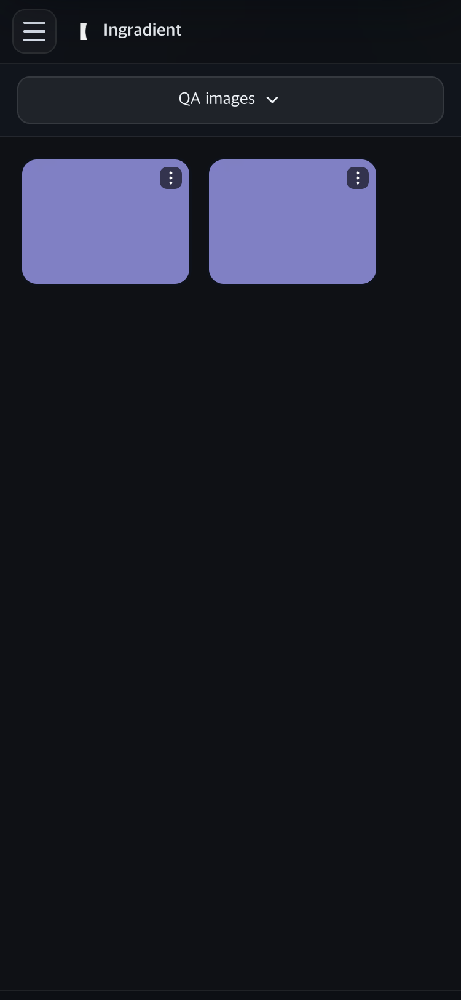 |

**볼 곳:** 왼쪽의 `View / Filter / Sort / Export / Upload`와 오른쪽에서 해당 메뉴가 보이지 않는 차이. 두 캡처의 화면 크기는 같지만 앱 구현 시점은 다르다.

**판정: 미해결.** 최종 화면 사용성 검토는 이 문제로 미통과다. 병합 중 추가한 연결 수정이 새로 만든 결함은 아니라는 검토 결과이지만, 최종 제품에 문제가 남아 있다는 사실은 같다. 오늘 커밋·병합 범위에서 추가 수정하지 않았다.

**다음 완료 기준:** 375×812에서 메뉴가 보이고, 보기·필터·정렬·내보내기·업로드를 실제로 실행할 수 있어야 한다. 자동 검사에도 이 확인을 추가해야 한다.

관련 위치: UI `CatalogView.styles.ts`의 화면 높이와 Platform `frontend/app/ProtectedAppShell.styles.ts`의 모바일 여백·넘침 처리. [최종 화면 검토 원문](assets/2026-09-08-daily/mobile-integrity-review.md)

## 8. 커밋·main 병합·push와 문서 정리

오늘 남아 있던 유효한 변경을 커밋하고, 두 저장소의 로컬 작업 브랜치를 main에 통합해 push했다. 이 항목은 화면 변경이 아니므로 이미지 대신 저장소 상태로 비교한다.

| 대상 | 통합 전 | 통합 후 |
|---|---|---|
| UI | 문서·실험 설정 등 미커밋 작업과 별도 브랜치 존재 | 구현 기준 `c210de1`, main·원격 일치 |
| Platform | UI 연결 수정·E2E 이전 작업 존재, 원격 main에 117개 추가 커밋 | 구현 기준 `540e2f3`, main·원격 일치 |
| 로컬 작업 보존 | 별도 작업 공간의 문서와 설정 남음 | 필요한 변경을 커밋·병합, 임시 도구 자료 보존 |
| 문서 | 오늘의 UI·소비자 연결 결과가 별도 리포트에 분산 | 이 문서에 오늘 작업과 비교 근거 정리 |

기존 `e2e-aside` 실험 파일은 보존했지만 일부 예전 도구 사용법은 아직 정리가 필요하다. 이번에 검증한 회귀 실행은 `node scripts/test-ui-integration.mjs`다. 소스 push는 완료했으며 운영 배포 완료를 의미하지 않는다. 위 커밋은 리포트 작성 전 구현 기준이다.

## 오늘 검증 결과와 다음 작업

| 확인 항목 | 결과 |
|---|---|
| UI 통합 단계 CI | 보존된 기록상 단위 317개·Storybook 506개·Linux 화면 15개 통과 |
| 최종 병합 후 UI 단위 테스트 | 66개 파일·317개 통과 |
| 최종 공개 경로 검사 | 통과 |
| 최종 Platform 빌드 | 통과, 주 파일 약 1.24MB 경고 잔존 |
| 실제 로컬 서버 브라우저 검사 | 23개 통과 |
| 최종 화면 충실도 검토 | 제공된 세 화면 범위에서 통과 |
| 최종 화면 사용성·잘림 검토 | **모바일 하단 메뉴로 미통과** |

가장 먼저 모바일 하단 메뉴를 수정하고 실제 조작 검증을 추가하는 것이 좋다. 이후 운영 인증·조직 권한·라이선스 연결, 기존 E2E와 경계 검사 스크립트, 실제 Edge 앱·장비 흐름을 확인할 필요가 있다. 운영 서비스의 이전 HTTP 503 기록은 오늘 이 문서를 쓰면서 재조회하지 않았다.

## 참고 자료와 이미지 출처

- [오늘 UI 통합 검증 리포트](2026-09-08-integration-readiness.md)
- [오늘 Platform 소비자 연결 리포트 — 최종 구현 커밋](https://github.com/InGradient/ingradient-platform/blob/540e2f34962cded9ddbb9dacea19d5e770df5de4/docs/reports/2026-09-08-ui-consumer-integration.md)
- [이미지·로그 출처 목록](assets/2026-09-08-daily/sources.md)

이 문서는 보존된 오늘의 실행 로그·실제 캡처를 읽어 작성했다. 문서 작성 중 제품 검사를 새로 실행하거나 과거 화면을 재현해 만든 것은 아니다. 과거 날짜 리포트의 비교 이미지를 오늘 수정 전후로 재사용하지 않았다.
