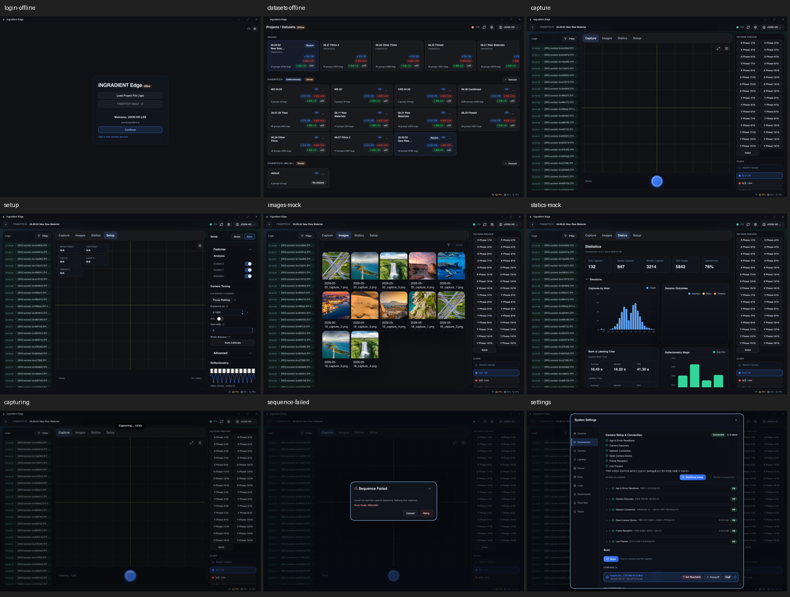
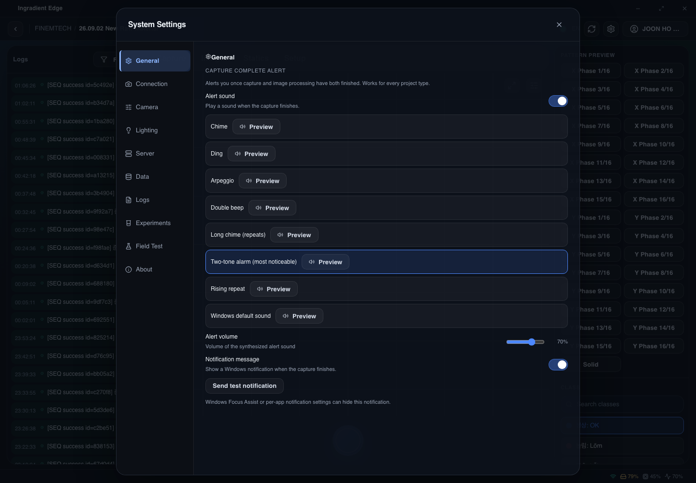

# 2026-09-20 Edge 0.0.5 레이어 감사·구현·검증

> **2026-09-21 통합 상태:** 구현 커밋 `4a85c21`을 로컬 `main`에 fast-forward 병합했다. 원격 push는 하지 않았고 worktree는 보존했다. 아래 ‘uncommitted/아직 병합하지 않음’ 문구는 검증 당시의 역사적 기록이다. 이번 보고서·증거는 구현과 분리한 문서 커밋으로 보존한다.

> 최신 범위는 **§18 남은 항목 통합 구현**이다. §17의 ‘아직 남은 작업’ 목록은 당시 1차 묶음 기록이며, §18의 항목별 결과가 이를 대체한다. 실제 장치·서버 구현을 완료했다는 뜻은 아니다.

## 1. 범위와 결론

- 기준: `main`의 `c2b2606`, [Edge PR #17](https://github.com/InGradient/ingradient-ui/pull/17), [변경 파일](https://github.com/InGradient/ingradient-ui/pull/17/files).
- **0단계: 조사·현재 화면 기록·실행 계획만 완료하는 작업이다. UI 구현 변경은 포함하지 않는다.**
- `stories/pages/edge/0.0.5`에서 실제 도달하는 View를 추적했다. 패키지에 존재한다는 이유만으로 모두 이 Page에서 사용한다고 계산하지 않았다.
- 기존 미커밋 문서와 리포트는 보존했다. 이 보고서와 증거는 primary checkout에 기록한다.
- 판단 기준: [레이어 경계](../reference/components-vs-patterns.md), [리팩터링 규칙](../../ui-refactoring-rule.md), [디자인 계약](../../DESIGN.md), [이전 통합 기록](2026-09-08-integration-readiness.md), [후속 통합 리포트](2026-09-08-consolidated-progress-report.ko.md).

**결론: 공용 UI를 처음부터 도입하는 작업이 아니다.** Login의 Primitive, Images의 VirtualizedImageGrid·AnnotationOverlay, Statics의 공용 차트, Settings의 SettingsRow·Slider·TwoColumnDialog·VerticalTabs는 이미 사용 중이다. root barrel import도 하위 레이어 사용으로 집계해야 한다.

우선순위는 **실행 가능한 상태 계약 → 접근성 → 중복 역할의 재사용 → 필요한 최소 확장**이다. 새 범용 Primitive/Pattern은 이번 감사에서 확정하지 않는다. Platform 제품 View를 Edge가 import하는 방식도 채택하지 않는다.

## 2. 실제 조립 구조

```text
Tokens / Primitives / Components / Patterns (@ingradient/ui)
                      ↓
              @ingradient/edge-pages
                      ↓
       Story fixture/runtime 또는 실제 Edge 앱

LoginScene → EdgeAppFrame → EdgeAppShellView + TitleBarView + LoginView
DatasetSelectScene → EdgeAppFrame + BottomBarView → DatasetSelectView
  ├─ DatasetSelectHeader / Content
  ├─ RecentDatasetCard / DatasetCardView → ContextMenuWithSubmenus
  └─ SessionExpired → ConfirmDialog
WorkspaceScene → EdgeAppFrame → MainLayoutView
  ├─ TopBarView + SettingsModal 슬롯
  ├─ LogPanelView → LogDetailTableView
  ├─ WorkspaceView → Tabs + Capture / Images / Statics
  │   ├─ CapturingPill
  │   └─ SequenceFailureDialog
  └─ RightPanelView 또는 SetupPanelView
      └─ CameraTuning / Advanced / Deflectometry / PatternPreview
```

근거: [workspace-scene.tsx](../../stories/pages/edge/0.0.5/workspace/workspace-scene.tsx), [build-shell.tsx](../../stories/pages/edge/0.0.5/shared/build-shell.tsx), [WorkspaceShell.tsx](../../packages/edge-pages/src/workspace/WorkspaceShell.tsx).

| 범위 | 구분 |
|---|---|
| 현재 열리는 경로 | Login, DatasetSelect, Capture/Setup/Images/Statics, Settings, SequenceFailed, Dataset SessionExpired |
| 코드가 있으나 현재 0.0.5에서 연결되지 않은 경로 | AddDataset/Export, Images 필터·삭제·라벨링 모달, Log 이미지 확대 |
| 이번 Page 도달 범위 밖 | SystemMonitor, BBoxCanvas, 독립 License 화면, 접힌 우측 패널·댓글/ROI, DerivedCalculateOverlay 등 |

미도달 경로는 삭제 대상으로 보지 않는다. 후속 연결과 회귀 테스트 목록으로 관리한다.

## 3. 레이어별 결정표

`확인`은 소스/API 확인이며 교체 후 타입·시각 검증 통과를 뜻하지 않는다. `후보`는 호환성 확인이 추가로 필요하다.

| 분류 | 대상 | 결정과 조건 |
|---|---|---|
| 그대로 사용 | Stack/Inline/Grid/Text/Heading, surface recipe | 단순 배치·글꼴을 담당한다. root import도 포함한다. |
| 그대로 사용 | SettingsRow, Slider, Switch, NumberField | 이미 Edge에 적용돼 있다. 입력 callback 형식이 서로 다르므로 일괄 치환 금지. |
| 그대로 사용 | VirtualizedImageGrid, AnnotationOverlay, 공용 차트 카드 | 이미 적절한 하위 UI 조합이다. Edge의 그룹·동기화·촬영 의미만 Page에 남긴다. |
| 기존 재사용 | Camera/Server의 label + input | FieldRow/FormField 등 기존 계약 검토. `htmlFor`와 input `id`는 명시적으로 연결한다. |
| 기존 재사용 후보 | Fringe 확대 화면 | 직접 backdrop/card 조합 대신 DialogShell 우선 검토. 이미지·프로파일 상태는 Edge 소유. |
| 기존 재사용 후보 | Log 상세 표와 메타데이터 | Table/KeyValueRow 검토. 로그 파싱·mono 표현·도메인 칼럼은 보존. |
| 기존 확장 후보 | SettingsSection | 기존 Platform 표면·제목·padding과 Edge의 compact 표현은 다르다. 필요가 입증되면 generic compact/plain 표현 검토. |
| 기존 확장 후보 | VerticalTabs / TwoColumnDialog | tab-panel 연결, 이름, focus containment를 공용 계약에서 검토. 기존 Escape·초기/복원 focus를 보존한다. |
| 기존 확장 후보 | CollapsibleSectionHeader | 기존 것을 우선 사용하되 expanded/controls 접근성 계약 보강 필요. Setup 전용 details를 즉시 없애지 않는다. |
| 기존 확장 후보 | StatCard | 현재 padding/radius 등이 고정이다. Edge metric 카드에 그대로 적용하면 밀도가 달라질 수 있다. |
| 기존 확장 후보 | DateRangeField / 필터 | Log·Images의 날짜 preset/범위 입력 공통화 후보. 가로/세로 배치와 label 계약 확인 후 적용. |
| Edge 내부 통합 후보 | PatternChoice | Setup과 우측 패널의 패턴 선택 스타일을 공유할 수 있다. 레이아웃은 wrap/2열로 분리하고 selected 의미를 보존. |
| Edge 전용 유지 | 셔터·십자선·격자·fringe·카메라 진단·타이틀바 drag | 제품 고유 표현과 controlled props를 유지한다. raw element 자체를 무조건 위반으로 간주하지 않는다. |
| 신규 공용 UI 보류 | 통합 Settings framework / Diagnostic pattern / Log pattern | 기존 API로 해결 가능한지 먼저 확인. Edge 내부 복수 사용만으로 범용성을 확정하지 않는다. |

공용 컴포넌트의 기본 표현을 바꾸면 Platform 소비자도 회귀 검증한다. 새 토큰은 부족한 계약과 소비 예시를 설명한 뒤 별도 승인받는다.

## 4. 화면별 사용처와 후속 작업

| 영역 | 이미 재사용하는 UI | 다음 작업 |
|---|---|---|
| Login | Stack/Inline/H1/Text, Card, 입력·Checkbox·Button | 입력 label 확인, Load/Continue를 관찰 가능한 mock workflow로 연결 |
| DatasetSelect | Grid/Stack/Text, Badge/Tag, 메뉴, EmptyState/ConfirmDialog | 카드 선택 키보드 동작, kebab 독립성, 선택·추가·내보내기 상태 연결 |
| Chrome / MainLayout | IconButton/StatusDot, surfacePanel | Edge 창 drag 영역 유지; Settings 열기 및 연결 상태의 상·중·하단 일관성 |
| Capture | Stack/Inline/Text, Card/Button, zoom hook | 장치 연결·촬영 상태·preview pattern 공유; 실제 MJPEG는 앱 책임 |
| Setup | FieldGroup/Hint, FieldLabelWithHelp, NumberField/Select/Switch | `as never` fixture 우회 제거, 저장·초기화·측정 mock, 패턴 선택 계약 |
| 우측 패널 | SelectableListItem/ColorSwatch/SearchField | 선택 의미·키보드 경로 점검, 패턴 선택 중복의 Edge-local 통합 |
| Logs | Switch/DatePickerField/DropdownSelect/Button | 실제 필터링, focus로 상세 열기, toggle 이름, 상세 표 재사용 검토 |
| Images | VirtualizedImageGrid/AnnotationOverlay/Checkbox | 선택 Set·필터·모달을 stateful하게 연결; 삭제 요청/확정 의미 분리 |
| Statics | Table, Bar/Line/PieChartCard | 기존 차트 유지, loading/empty/error 정의, compact metric·접이식 header 검토 |

주요 소스: [Capture builder](../../stories/pages/edge/0.0.5/workspace/build-capture-content.tsx), [Images builder](../../stories/pages/edge/0.0.5/workspace/build-images-content.tsx), [패널 builder](../../stories/pages/edge/0.0.5/workspace/build-panels.tsx), [Setup builder](../../stories/pages/edge/0.0.5/workspace/build-setup-content.tsx).

## 5. Settings 10개 탭 매핑

연결: `Workspace / Settings` → WorkspaceScene의 open 상태 → `build-settings-modal.tsx`의 activeTab → CameraSettingsDialogView → TwoColumnDialog + VerticalTabs + content slot. 초기 탭은 Connection이다.

| 탭 | Edge View / 하위 UI | 상태·재사용 판정 |
|---|---|---|
| General | GeneralTabView / SettingsRow, Slider, Switch, SelectableListItem, Button | 공용 UI 유지. 중첩 버튼 수정·상태 생명주기·Preview/Test callback 보강 |
| Connection | ConnectionTabView + CameraSetupPanel / Card, Badge, StatusIcon, StepIndicator, 목록 | 카메라 진단은 Edge 유지. 실제 scan/connect는 앱 책임; Story는 deterministic mock |
| Camera | CameraParamsTabView / TextField, Button | label 연결·공용 폼 배치, 편집/적용/실패 fixture |
| Lighting | LightingTabView + MonitorPickerView/PsLightPanelView / SettingsRow, NumberField, Switch | 프로젝트별 분기 유지; 분리·reload·identify 상태 검증 |
| Server | ServerTabView / FieldRow, FieldGroup, TextField, RadioCardGroup | label 연결, URL·모드 편집 및 저장 결과 mock |
| Data | DataTabView / CodeBlock, KeyValueRow, Button | 경로·용량 유지; 정리 확인/진행/결과 상태 |
| Logs | UnifiedLogsTabView + Backend/Frontend / ModeSwitcher, 검색·필터 | Edge LogEntry 기반 shell 유지. 소스 전환 외 필터·clear·export 연결 |
| Experiments | ExperimentsTabView / SettingsRow, NumberField, Switch, InlineMessage | 삭제 후 primary index 유효성 보장; 총 장수 계산은 앱/runtime |
| Field Test | FieldTestTabView / Button, ProgressBar | 실행·취소·결과·내보내기 mock 상태 |
| About | AboutTabView + UpdateSectionView / DialogShell, CodeBlock, KeyValueRow, ProgressBar | 버전·라이선스 의미 유지; 업데이트/비활성화 동작 fixture |

근거: [Settings 조립](../../stories/pages/edge/0.0.5/settings/build-settings-modal.tsx), [새 탭 runtime](../../stories/pages/edge/0.0.5/settings/tabs-moved.tsx), [기존 탭 runtime](../../stories/pages/edge/0.0.5/settings/tabs-legacy.tsx), [Dialog View](../../packages/edge-pages/src/settings/CameraSettingsDialogView.tsx).

Platform은 같은 SettingsRow/VerticalTabs 등 하위 API를 사용하지만 **SettingsModal 전체가 동일한 계약은 아니다.** Platform 모달은 자체 frame을 사용하며 Edge는 TwoColumnDialog를 사용한다. 전체 모달 통합은 이번 첫 작업에 포함하지 않는다.

## 6. 우선 해결할 계약 공백

| 우선순위 | 발견 | 근거 / 검증 수준 |
|---|---|---|
| P0 | 톱니 버튼의 Settings 열기 callback이 noop | `shared/build-shell.tsx:83`; 소스 확인. 초기-open Story가 이 공백을 가린다. |
| P0 | General 선택 행 안에 Preview 버튼 중첩 | `GeneralTabView.tsx:39–58`, SelectableListItem 기본 element는 button. stopPropagation은 마크업 문제를 해결하지 않는다. |
| P0 | General/Lighting/Experiments 상태가 탭 컴포넌트 내부에 존재 | `tabs-moved.tsx:14–18,41–45,97–101`; active content만 렌더하므로 탭 이탈 시 state 소실 가능. |
| P0 | 역할에 따라 탭 목록만 숨기고 content는 activeTab 그대로 렌더 | `CameraSettingsDialogView.tsx:24–69`; 보이는 탭으로 정규화 필요. 서버 권한 검사를 대체하지 않는다. |
| P0 | Dataset 카드의 click에 키보드 동작이 없음 | `DatasetCardView.tsx:37–59`, `dataset-card.styles.ts:31`; 내부 kebab과 선택 동작을 분리해야 한다. |
| P0 | Fringe 확대의 dialog/focus 계약 부족 | `FringeProfilePreviewView.tsx:38–43,65–86`; shared DialogShell 재사용 후보. |
| P0 | Offline이 상단 상태만 바꾸고 Capture/footer는 같은 상태를 공유하지 않음 | `Workspace.stories.tsx:68–69`, `build-capture-content.tsx:18–28`, `workspace-scene.tsx:80`; fixture 일관성 문제. |
| P1 | Log filter 값은 바뀌지만 목록은 전체 fixture 그대로 | `build-panels.tsx:41–52,73–78`; hover 상세의 키보드 대안도 필요. |
| P1 | Images 선택/필터/모달과 대부분 액션은 noop | `build-images-content.tsx:44–94`; 표시 성공과 동작 완성을 분리한다. |
| P1 | Settings 기존 탭의 입력·저장·장치 액션이 noop | `tabs-legacy.tsx:17–140`; 실제 API 대신 mock state와 Actions부터 연결. |
| P1 | Experiments 삭제 후 primary index가 범위를 벗어날 수 있음 | `tabs-moved.tsx:99,107,115`; controller에서 정규화. |

공용 UI도 자동으로 완성된 접근성 기준은 아니다. VerticalTabs의 panel 연결, TwoColumnDialog의 focus containment, CollapsibleSectionHeader의 expanded 계약은 별도 검증·보강 대상으로 둔다. 이전 전체 테스트 통과 수치를 신규 Edge 경로의 검증 결과로 재사용하지 않는다.

브라우저에서 추가 확인한 사실:

- General DOM에 `button button` 중첩이 **8개** 존재한다.
- volume을 키보드로 **70 → 65**로 변경한 뒤 Connection → General로 돌아오면 **70으로 초기화**된다.
- 선택된 tab의 `aria-controls`는 없다.
- Escape로 Settings가 닫힌다. 이는 focus trap/restore까지 모두 검증했다는 뜻은 아니다.
- 닫은 뒤 `title="Settings"` 톱니 버튼을 눌러도 dialog 수는 0으로, 재열기가 연결되지 않았다.

증거: [interaction-probe.json](assets/2026-09-20-edge-phase0/interaction-probe.json). 핵심 소스 permalink: [General 중첩](https://github.com/InGradient/ingradient-ui/blob/c2b2606/packages/edge-pages/src/settings/tabs/GeneralTabView.tsx#L39-L58), [탭별 local state](https://github.com/InGradient/ingradient-ui/blob/c2b2606/stories/pages/edge/0.0.5/settings/tabs-moved.tsx#L14-L18), [Settings noop](https://github.com/InGradient/ingradient-ui/blob/c2b2606/stories/pages/edge/0.0.5/shared/build-shell.tsx#L83).

## 7. 변경 전 화면 증거

현재-state 캡처이며 before/after 완료 증거가 아니다. macOS Chromium, 1440×1000 viewport. Linux visual baseline을 생성하거나 교체하지 않았다. 전체 페이지 가로 scrollWidth는 캡처한 9개 상태에서 1440이었다. 이는 내부 패널 잘림·좁은 화면·전체 접근성 통과를 보증하지 않는다.



| 화면 | 원본 캡처 | Story ID (`?path=/story/` 뒤에 사용) |
|---|---|---|
| Login Offline | [원본](assets/2026-09-20-edge-phase0/login-offline.png) | `pages-edge-0-0-5-login--offline` |
| DatasetSelect Offline | [원본](assets/2026-09-20-edge-phase0/datasets-offline.png) | `pages-edge-0-0-5-datasetselect--offline` |
| Capture | [원본](assets/2026-09-20-edge-phase0/capture.png) | `pages-edge-0-0-5-workspace--capture` |
| Setup | [원본](assets/2026-09-20-edge-phase0/setup.png) | `pages-edge-0-0-5-workspace--setup` |
| Images (mock) | [원본](assets/2026-09-20-edge-phase0/images-mock.png) | `pages-edge-0-0-5-workspace--images` |
| Statics (mock) | [원본](assets/2026-09-20-edge-phase0/statics-mock.png) | `pages-edge-0-0-5-workspace--statics` |
| Capturing | [원본](assets/2026-09-20-edge-phase0/capturing.png) | `pages-edge-0-0-5-workspace--capturing` |
| SequenceFailed | [원본](assets/2026-09-20-edge-phase0/sequence-failed.png) | `pages-edge-0-0-5-workspace--sequence-failed` |
| Settings Connection | [원본](assets/2026-09-20-edge-phase0/settings.png) | `pages-edge-0-0-5-workspace--settings` |

Settings는 실제 탭 버튼을 클릭해 10개 탭을 기록했다. [General](assets/2026-09-20-edge-phase0/settings-general.png), [Connection](assets/2026-09-20-edge-phase0/settings-connection.png), [Camera](assets/2026-09-20-edge-phase0/settings-camera.png), [Lighting](assets/2026-09-20-edge-phase0/settings-lighting.png), [Server](assets/2026-09-20-edge-phase0/settings-server.png), [Data](assets/2026-09-20-edge-phase0/settings-data.png), [Logs](assets/2026-09-20-edge-phase0/settings-logs.png), [Experiments](assets/2026-09-20-edge-phase0/settings-experiments.png), [Field Test](assets/2026-09-20-edge-phase0/settings-field-test.png), [About](assets/2026-09-20-edge-phase0/settings-about.png).



증거 manifest: [주요 화면](assets/2026-09-20-edge-phase0/capture-manifest.json), [탭별 텍스트](assets/2026-09-20-edge-phase0/settings-manifest.json). Capture의 빈 프리뷰와 Images/Statics mock은 기존 fixture 범위다. Settings Connection 캡처에서 상단 Connected/6단계 완료와 장치 목록 Not Reachable이 함께 보여, 상태 fixture 정합성도 후속 점검 대상으로 둔다.

## 8. 단계별 실행 계획

| 단계 | 범위 | 완료 기준 |
|---|---|---|
| 0 | 사용처·재사용 후보·현재 화면·계획 | 이 보고서와 변경 전 증거, UI 수정 없음 |
| 1A | Settings General의 기존 Primitive/Component 계약 정리 | 선택과 Preview 독립 키보드 동작, nested button 제거, 기존 밀도 유지 |
| 1B | shared tab/dialog 계약 최소 보강 | tab-panel 연결, focus containment/restore, 역할별 activeTab 정규화; Platform 소비자 회귀 확인 |
| 1C | Settings 열기와 General runtime | gear→General 편집→탭 왕복→닫기/재열기 workflow, Actions와 deterministic fixture |
| 2 | 나머지 Settings | 라벨·폼·결과 표시 재사용, 탭별 정상/진행/실패/비활성 상태 |
| 3 | Capture/Setup/Logs/우측 패널 | 연결 상태 일관성, 접근성, 패턴 선택·필터 동작, 필요 최소 확장 |
| 4 | Login/DatasetSelect/Images/Statics | 목록·선택·다이얼로그 workflow와 loading/empty/error 상태 |
| 5 | 전체 Page composition과 공개 API | Story에 있는 제품 조립만 package로 추출, fixture/runtime은 Story에 유지 |
| 6 | 통합·배포 검증 | unit/type/lint, 공식 MCP story/a11y, packed consumer, 승인된 Linux visual |

각 구현 단계는 별도 worktree에서 진행한다. **하위 UI → Edge View → Page → Story workflow** 순서로 적용하고, 화면 변경은 전·후 증거로 검토한다. 단순 레이어 파일 이동이나 styled 개수 감소를 완료 지표로 삼지 않는다.

## 9. 첫 구현 묶음: Settings → General

범위: 기존 10개 탭과 앱 프레임은 유지한다. 새로운 범용 Settings framework, 전체 재디자인, 실제 알림음/OS 알림/장치 연결은 제외한다.

1. SettingsRow·Slider·Switch는 그대로 사용한다.
2. General의 선택 target과 Preview target을 형제로 분리한다. 필요한 경우 기존 선택 surface 계약을 최소 확장하고 공용 Story에서 먼저 검증한다.
3. dialog/tab 접근성 계약은 하위 UI에서 해결하고 Edge에서 소비한다.
4. `buildTopBar`에 실제 open callback을 전달한다.
5. General fixture state를 탭보다 오래 사는 controller로 올린다. **제안 정책: 현재 Workspace 세션 안에서는 탭 왕복·닫기/재열기 후 유지, 시나리오 reset 시 초기화.** 실제 앱 저장 정책과 별도로 명시한다.
6. Preview/Test는 Actions와 성공/실패 mock을 제공한다. 실제 OS 알림 성공이라고 표시하지 않는다.
7. role별 activeTab을 보이는 탭으로 정규화한다. 사용자 권한 판단 자체는 앱이 소유한다.

| 수용 테스트 | 기대 결과 |
|---|---|
| 톱니 열기 / 닫기 / Escape / 재열기 | Dialog 표시, 닫힘, trigger로 focus 복원 |
| 소리·메시지 toggle / Slider | 독립적으로 controlled 값 갱신 |
| Windows default sound 선택 | volume disabled와 이유 표시; 다른 소리 선택 시 활성화 |
| Preview | 선택 변경 없이 해당 callback 한 번; 선택/Preview 각각 키보드 접근 |
| General→다른 탭→General | 편집값 유지 |
| role 변경·숨겨진 activeTab | 허용된 탭과 content로 정규화 |
| 키보드 tab/arrow/Home/End | 문서화된 탭 탐색, panel 연결, modal focus containment |
| mock 실패 | 읽을 수 있는 오류·결과 표시, 실제 백엔드 사용 없음 |
| 시각·회귀 | 1440/1280 및 좁은 창에서 내부 scroll·control 접근 확인; shared 변경의 Platform 소비자 검증 |

## 10. 검증 한계와 다음 세션 인계

- 이번 작업은 소스 감사와 현재 화면 기록이다. 전체 unit/Storybook/a11y/CI를 새로 통과했다고 주장하지 않는다.
- 공식 MCP로 documentation 목록과 하위 UI 문서 15개를 조회했다: Layout, Typography, Surfaces, SettingsRow, SettingsSection, Slider, TwoColumnDialog, CollapsibleSectionHeader, SelectableListItem, Table, ResizableColumnsLayout, ChartContainer, CommentThread, ImageGrid, VerticalTabs. 일부 문서는 Story 예제 중심이므로 문서 응답 성공을 모든 props·행동의 검증으로 보지 않는다. 설치된 CLI에 예전 helper 경로가 없어 기존 MCP SDK의 HTTP transport를 사용했다. 프로젝트 설정·의존성은 바꾸지 않았다.
- Settings 첫 캡처 시 dialog 대기가 30초에 timeout했다. 진단 출력을 추가하고 대기를 90초로 늘린 수집 스크립트에서 10개 탭 캡처를 완료했다. 제품 코드를 수정해 숨기지 않았다.
- Storybook runtime 상태가 바뀔 수 있으므로 새 세션에서는 listener cwd·HEAD·story index를 다시 확인한다. 임시 서버 포트는 영구 계약으로 기록하지 않는다.
- 다음 작업 시작점은 **9절의 Settings General 묶음**이다. 0.0.1 삭제, 광범위한 모달 통합, 실제 Electron 연결은 승인 범위 밖이다.
- 커밋·push·PR은 수행하지 않는다. 문서와 이미지 검토 후 구현 범위를 확정한다.

## 11. 추가 감사 — 메뉴 스타일 차이와 하드코딩

사용자가 메뉴 스타일 차이를 지적하여 다음 구현을 보류하고 재확인했다. **공용 컴포넌트 사용 여부만으로 시각적 일관성을 판단한 0단계 결론은 부족했다.** 실제 차이는 아래 세 원인을 구분해야 한다.

### 11.1 Settings 메뉴: 같은 컴포넌트에 서로 다른 스타일 적용

- Edge는 `CameraSettingsDialogView.tsx:55–69`에서 기본 VerticalTabs를 사용한다.
- Platform은 `SettingsModalView.styles.ts:52–87`에서 `styled(VerticalTabs)`로 highlight를 숨기고 높이·padding·radius·selected·hover 색을 덮어쓴다.
- 모두 토큰을 사용하더라도 페이지별 CSS override 때문에 스타일이 갈라진다. 이는 raw 색상 하드코딩과는 별개다. 현재 공용 VerticalTabs의 정식 appearance variant로 구분된 것도 아니다.
- 같은 1440×1000 viewport에서 dialog 내부 tab을 측정: Edge 높이 44px / padding 10px 10px 10px 12px / radius 14px, Platform 높이 48px / padding 8px 10px / radius 10px. Edge highlight는 표시되고 Platform에서는 숨겨진다. 상태 색상은 hover·Story play 시점에 영향받으므로 단일 순간의 색상 값을 고정 계약으로 해석하지 않는다.

### 11.2 Edge 0.0.5 preset 연결 누락

- Workspace handoff는 `version: '0.0.5'`, `preset: 'edge-0.0.1'`을 선언한다.
- `.storybook/preview.tsx:23–30,159–165`는 `handoff.preset`이 아니라 service/version으로 찾으며, 등록된 Edge 버전은 0.0.1뿐이다.
- 결과적으로 0.0.5는 PresetProvider 대신 기본 ThemeProvider로 들어간다(`:213–222`). compact density가 적용되지 않는다.
- 브라우저에서도 Edge는 preset/density 속성이 없고 `--ig-control-height-lg`는 44px, Platform은 `platform-0.0.1`/`compact` 속성과 40px가 확인됐다. 이 토큰 값과 각 tab의 실제 높이는 별개이며 Platform tab은 별도 XL override를 쓴다.
- 메뉴 CSS 수정 전에 이 preset 연결부터 복구해야 한다. 다만 preset 복구도 시각 변경이므로 영향 화면을 재캡처해야 한다.

### 11.3 실제 raw 색상과 검사 사각지대

- `packages/edge-pages/src/capture/CaptureView.styles.ts:161,173`에는 `rgba(255, 255, 255, 0.25)` / `rgba(255, 255, 255, 0.5)`가 직접 들어 있다. 메뉴가 아닌 촬영 버튼 테두리다.
- `npm run check:style-literals`는 통과했지만, 검사기 `scripts/check-style-literals.mjs:63–69`는 한 줄에 `var(--...)`가 있으면 줄 전체를 건너뛴다. 토큰 border 폭과 raw 색상이 같은 줄에 있어 누락된다.
- 따라서 검사 통과는 하드코딩 부재의 증거가 아니다. 또한 이 검사는 주로 raw 색상 검사로, 모든 크기·간격·페이지 override를 포괄하지 않는다.

증거: [측정 JSON](assets/2026-09-20-edge-phase0/menu-comparison.json), [Edge Settings](assets/2026-09-20-edge-phase0/edge-settings-menu.png), [Platform Settings](assets/2026-09-20-edge-phase0/platform-settings-menu.png).

### 11.4 다른 메뉴의 소스 감사

| 메뉴 | 차이의 실제 종류 | 근거 |
|---|---|---|
| Workspace 탭 | 공용 Tabs의 기본 pill 사용. Platform Settings 일부 하위 탭은 underline. 같은 기능이라고 단정하지 않음 | `WorkspaceShell.tsx:27–32`, Platform `settings-modal/tabs/AdminTab.tsx:43–47` |
| Dataset 더보기 | 팝업은 양쪽 모두 ContextMenuWithSubmenus. Edge는 IconButton + 가로 점 14px, Platform은 MenuIconButton + 세로 점 18px 및 열림 강조 | Edge `DatasetCardView.tsx:47–74`, Platform `dataset-list-item.tsx:113–125` |
| 계정/언어 | 계정은 공용 Button/ContextMenu지만 현재 fixture에서 닫힘 고정. EN은 메뉴가 아닌 토큰화된 span placeholder | `shared/build-shell.tsx:16–34` |
| Images 필터 | Edge MenuIconButton과 Platform FilterPopoverTrigger의 배경·열림 강조 계약이 다름. Edge 내부 팝업은 현재 미연결 | Edge `ImagesView.tsx:68–93`, Platform `CatalogToolbarRow.tsx:79–105` |
| Images 메뉴 폭 | `chartHeights.lg`를 popover 폭으로 사용. raw literal은 아니지만 토큰의 의미가 부적절 | `ImagesView.tsx:79` |
| 촬영 패턴 선택 | 공용 Button 위에 blue-tint/white 계열 색을 별도 적용한 중복 표현. Edge-local 통합 후보 | `SetupPanelView.styles.ts:47–55`, `RightPanelView.styles.ts:54–61` |

공용 ContextMenu에도 위치 계산 상수(offset 4, viewport 여백 8 등)가 있다. 이를 디자인 색상 하드코딩과 한꺼번에 분류하거나 Edge 전용 차이의 원인으로 단정하지 않는다.

**수정 전 우선순위 제안:** preset 연결 → 검사 사각지대와 확인된 literal 정리 → 메뉴의 공용 표현 계약 합의·최소 확장 → Settings General workflow. Platform CSS를 Edge 페이지에 그대로 복사하지 않고, 공통 표현은 하위 UI의 문서화된 계약으로 만든다. 이번 추가 감사에서도 UI 소스는 수정하지 않았다.

## 12. 포괄적 보충 0단계 — 실제 검증 범위와 정정

이 절은 사용자 승인에 따라 **구현 전 조사 범위를 확장한 결과**다. §8–11의 구현 순서는 아래 §16으로 보완한다. ‘포괄적’은 감사 축을 넓혔다는 뜻이며, 모든 버그·상태·조합을 찾았다는 뜻이 아니다.

### 12.1 환경·계약·증거 수준

- primary checkout `/Users/homebodify/Projects/ingradient-ui`, `main`, HEAD `c2b2606706f9f24e996d2f187325838328bc9b6e`. 기존 Storybook listener PID 79855의 cwd가 이 checkout임을 `lsof`로 확인했다. 별도 서버·worktree를 만들지 않았다.
- [README](../../README.md), [DESIGN](../../DESIGN.md), [리팩터링 규칙](../../ui-refactoring-rule.md), [레이어 계약](../reference/components-vs-patterns.md), [감사 절차](../guides/ui-audit.md), [작업 절차](../guides/ui-workflow.md), [0.0.5 Story 계약](../../stories/pages/edge/0.0.5/README.md), 기존 보고서 §11과 agent handoff를 읽었다. `packages/edge-pages/README.md`는 현재 존재하지 않는다.
- browser-use/로컬 storybook-mcp-review 절차를 읽고, 공식 HTTP `/mcp`의 tool·documentation 목록을 다시 조회했다. TwoColumnDialog, DialogShell, ChartTooltipContent, FieldRow/FormField, DateRangeField, StatCard 6개 문서를 **순차** 조회했다. [MCP 원문](assets/2026-09-20-edge-phase0/supplemental-mcp.json), [재실행 스크립트](assets/2026-09-20-edge-phase0/supplemental-mcp.cjs). 일부 응답은 Story 예제만 있으므로 타입 전체 검증으로 해석하지 않는다.
- macOS, 설치된 Playwright의 **격리된 headless Chromium**, 1280×800 / 768×800. 사용자 Chrome·열린 탭은 건드리지 않았다. 실제 장치·OS·API·파일 삭제는 실행하지 않았다.
- 표의 **확인(R)** = 해당 브라우저 관찰, **확인(S)** = 소스 계약, **문제(R/S)** = 그 수준에서 확인한 문제, **미검증(U)** = 이번에 실행하지 않은 범위. ‘확인’은 그 행 전체 합격이 아니다. 재사용 후보는 구현 승인·호환성 검증을 대신하지 않는다.

### 12.2 실행 모집단과 커버리지

Story index에서 **0.0.5 Story 19개**를 확인했다. Login 4개(Offline, OfflineNoPackage, OnlineForm, Error), DatasetSelect 6개(Offline, Online, Loading, Empty, FetchError, SessionExpired), Workspace 9개(Capture, Images, Statics, Setup, Capturing, SequenceFailed, LogFilterOpen, Offline, Settings)다.

| 모집단 | 이번 확인 | 남은 경계 |
|---|---|---|
| 19개 Story × 2 viewport | 38개 경로 렌더/DOM 관찰. Settings 1280 최초 axe 충돌은 별도 재시도로 보충 | 장치/서버 workflow, 모든 hover/focus/disabled 조합의 시각 승인 아님 |
| Settings 10개 탭 × 2 viewport | 실제 클릭 20회, 각 content/DOM 기록 | owner fixture만 사용. role별 content 정규화는 소스 확인만 |
| 1280 접근성 | Story 19개 + 탭 10개 = **29개 axe 스캔**(Settings 기본 Connection과 탭 Connection은 중복 상태) | 768 axe, light/고대비, 스크린리더, 200% 확대, reduced-motion 미실행 |
| UI family 감사표 | 아래 **23개 묶음**의 재사용·문제·미검증 판정 | 파일 수/전체 코드 커버리지율로 환산하지 않음 |
| 0.0.5 미도달 분기 | 별도 **10개 묶음** 소스/조립 확인 | 강제로 새 Story를 만들거나 실제 경로로 연결하지 않음 |

원문: [경로·탭·axe·초기 probe](assets/2026-09-20-edge-phase0/supplemental-browser.json), [수정된 probe·geometry](assets/2026-09-20-edge-phase0/supplemental-followup.json), [추가 control probe](assets/2026-09-20-edge-phase0/supplemental-controls.json). 재현 코드: [browser](assets/2026-09-20-edge-phase0/supplemental-browser.cjs), [followup](assets/2026-09-20-edge-phase0/supplemental-followup.cjs), [controls](assets/2026-09-20-edge-phase0/supplemental-controls.cjs). 주소/포트는 이번 세션의 실행 위치이며 영구 서비스 계약이 아니다.

### 12.3 실제 UI family 판정표

`P`는 `packages/edge-pages/src/`, `S`는 `stories/pages/edge/0.0.5/`를 뜻한다. 각 세부 소스·줄은 §13–15에도 명시한다. `@ingradient/ui` root는 `src/index.ts:1–7`에서 patterns까지 재수출한다. root import를 ‘Primitive만 사용’ 또는 ‘pattern 미사용’으로 세지 않았다.

| # | 실제 family | 확인/재사용 판정 | 문제·미검증 |
|---|---|---|---|
| 1 | preset/theme/density/portal | 확인(S/R): html-root 변수는 body portal에도 상속 | 문제(R): 0.0.5에서 density override도 무시. 복수 preset 동시 mount는 U |
| 2 | title/top/bottom chrome, account/language/status | 확인(S): IconButton/StatusDot/Button 재사용; Electron drag/창 chrome은 제품 소유 | 문제(S): back/refresh/account/monitor noop, EN placeholder. 실제 Electron/OS 동작 U |
| 3 | Login 4상태/폼/계정 카드 | 확인(S/R): email/password의 명시적 label 연결, 공용 Card/입력/Checkbox; 기본 4상태 axe 위반 0 | 문제(S): submit은 preventDefault뿐; package/계정 이동 noop. 인증 성공·loading 진행 U |
| 4 | DatasetSelect 6상태/최근·일반 카드/kebab | 확인(S): 최근 카드는 native button, 일반 카드는 div로 **동일하게 분류하지 않음**. ContextMenuWithSubmenus 재사용 | 문제(S/R): 일반 카드 키보드 선택 공백, class chip 대비 실패; export/add noop |
| 5 | Workspace 탭/촬영 잠금/실패 dialog | 확인(R): 4탭 클릭·ArrowRight 전환 | 문제(R): 촬영 blocker를 정상 Tab 경로로 우회; 실패/세션 만료 modal Escape·취소 상태 고정 |
| 6 | Capture preview/grid/controls/zoom/shutter/metric | 확인(S): Card/Button·zoom hook 재사용, 격자/십자선/셔터는 Edge 전용 | 문제(S): liveFrameSrc 없음, capture noop; preview/connection fixture 정합성. 전체 fullscreen/zoom 제스처 U |
| 7 | Setup Features/CameraTuning/Advanced/Deflectometry/Fringe | 확인(R): Advanced 펼침, 입력 이름·hardware disabled 확인, Fringe 확대/Escape | 문제(R/S): 감마/요약 파생값 계약, 확대 dialog 의미 없음, 저장/reset noop. 실제 측정 U |
| 8 | 우측 Pattern/Class/Search와 Setup Pattern | 확인(S): SearchField/SelectableListItem/ColorSwatch 사용, 도메인 패턴 선택은 Edge-local 통합 후보 | 문제(R/S): selected가 시각 CSS뿐; 패턴 state가 Capture와 별개. 모든 검색/선택 회귀 U |
| 9 | Workspace Logs/filter/date/detail/table | 확인(S/R): 공용 Switch/Dropdown/DatePicker; hover 상세 실제 등장 | 문제(R/S): 이름 없는 switch, hover-only 상세, filter 후 원본 entries 유지, scroll axe 실패. custom date calendar 키보드 U |
| 10 | Images/grid/selection/group badge/sync/annotation | 확인(S/R): VirtualizedImageGrid/AnnotationOverlay 이미 사용 | 문제(R): Select all 클릭 후 false 유지. 문제(S): 필터·삭제·labeling 미연결, 픽셀 geometry와 token 의미 검토 필요 |
| 11 | Statics summary card/section header | 확인(S): 공용 Card 사용; native button으로 collapse 처리 | 문제(S): `aria-expanded/controls` 없음, 5열 고정; StatCard 후보는 밀도 계약부터. 좁은 중앙창 문제(R) |
| 12 | Statics 차트/tooltip/worker table | 확인(S/R): chart cards/Table 재사용, 정상 mock 렌더 | 문제(S): tooltip 2종 공용 shell 재구현; numeric chart height와 도메인 formatter 분리 검토. 전체 차트 키보드·empty/error U |
| 13 | Settings shell/VerticalTabs/TwoColumnDialog | 확인(R): 10탭·ArrowDown/Home/End, body portal | 문제(R): 마지막 control의 Tab이 BODY로 이탈. 문제(S/R): tab-panel 관계 없음; hidden-role content는 S만 |
| 14 | General | 확인(R): slider·선택 fixture 존재; 공용 SettingsRow/Slider/Switch 유지 | 문제(R): 기존 8 nested button 외 **중첩 label/이름 없는 switch 2개** 추가. Preview/Test 결과 U/noop(S) |
| 15 | Connection/6단계/scan/NIC/diagnostic/profile | 확인(S/R): 단계 header의 expanded/controls는 있음; 카드 선택 UI 렌더 | 문제(R): Force IP도 nested button 1개. scan/connect/diagnose 결과 noop(S), 강제 IP modal 미도달 |
| 16 | Camera | 확인(S/R): TextField/Button 사용, 탭 렌더 | 문제(S): label 연결 없음, placeholder가 axe 통과를 대신함. DLL/Apply/Save frozen, 실패/진행 U |
| 17 | Lighting | 확인(R): **deflectometry의 MonitorPicker만 렌더**. 모니터 선택 가능 | 문제(R): Auto 선택→탭 왕복 시 DISPLAY2 복귀; selected ARIA 없음. PS light는 미도달(U) |
| 18 | Server | 확인(S/R): FieldRow/RadioCardGroup 사용 | 문제(R): URL을 입력해도 이전 값 유지; label/id 없음. mode/save 결과 S/noop |
| 19 | Data | 확인(S/R): CodeBlock/KeyValueRow/Button, 경로·용량 표시 | 문제(S): clean/open noop, 확인/진행/완료 fixture U |
| 20 | Settings Logs Backend/Frontend | 확인(S): ModeSwitcher + 공용 logs shell | 문제(S): source 외 검색·level·clear/export frozen. 두 source의 전체 workflow U |
| 21 | Experiments | 확인(S/R): SettingsRow/NumberField, enable 후 periods 조작 경로 | 문제(R/S): switch label, primaryIndex 고정·total 문구 고정, 탭 이탈 reset. 실제 촬영수 계산 U |
| 22 | Field Test | 확인(S/R): Button/ProgressBar, idle 탭 | 문제(S): run/cancel/reset/export noop; 실행·중단·성공·실패 상태 U |
| 23 | About/Update/license metadata | 확인(S/R): KeyValueRow/CodeBlock/ProgressBar 사용, idle 표시 | 문제(S): update/deactivate noop; nested code dialog/업데이트 수명주기 U |

### 12.4 미도달 overlay/분기는 실제 화면과 분리

아래 표는 ‘문제 없음’이 아니라 **0.0.5 runtime 검증에서 제외됨**을 뜻한다. §5의 Lighting 하위 UI 목록은 import/slot 목록이지 PsLightPanel까지 실제 렌더됐다는 증거가 아니다.

| # | 미도달 묶음 | 연결/소스 판정 | 연결 전에 필요한 검증 |
|---|---|---|---|
| U1 | Account dropdown/change-account dialog | `S/shared/build-shell.tsx`에서 closed 고정; `P/chrome/AccountMenuView.tsx:21–74`는 ContextMenu/DialogShell 사용 | trigger expanded/name, 메뉴 focus 복원, 계정 전환 mock |
| U2 | AddDataset/CreateProject | `S/DatasetSelect.stories.tsx:54–56` noop; `P/dataset-modals/AddDatasetModalView.tsx:27–80` 공용 DialogShell·폼 | dataset name label/id 없음(:48–55), submit/validation/busy |
| U3 | Export dialog | 같은 export noop; `P/dataset-modals/ExportModalView.tsx:30–58` running 동안 close 차단 | 진행·error·done, progress 이름, 취소 정책 |
| U4 | ForceIpDialog | `S/settings/build-connection-content.tsx:34` noop; `P/connection/ForceIpDialogView.tsx:28–37` label 연결 없음 | 주소 검증·적용·취소·focus; 이번엔 실제 IP 변경 안 함 |
| U5 | Images filter/date popover | `S/workspace/build-images-content.tsx` filterOpen=false·toggle noop | label/선택/escape/outside-click, dropdown/calendar overlay 스택 |
| U6 | Images delete confirm + labeling/image modal | modalOpen=false/pendingDelete=null; `P/images/ImagesView.tsx:49–57,138–217` | request/confirm 분리; bespoke overlay의 role/이름/Escape/trap/swipe. BBoxCanvas 연결 전 별도 검수 |
| U7 | Log 이미지 확대 | `S/workspace/build-panels.tsx:68` displayImageUrl=null | `P/log/LogPanelView.tsx:160–165` body portal이나 dialog/Escape/focus 없음(S). 데이터가 없는 현재 화면에서 검증했다고 하지 않음 |
| U8 | SystemMonitor/cleanup | footer open noop; `P/system/SystemMonitorModalView.tsx:17–29` TwoColumnDialog/Tabs 사용 | 공유 focus/tab 수정 전파, 삭제 확인·상태·키보드 |
| U9 | capture review/derived/labeling·collapsed·ROI/comment | `P/capture/CaptureReviewFullscreen.tsx`, DerivedCalculateOverlayView, WorkspaceLabelingShell, RightPanelCollapsedView 등 export 존재만 확인; 현재 조립은 main·빈 슬롯·ROI=false | 각 분기 소유권/회귀는 후속. 전문 영상/canvas 동작은 이번 감사 미검증 |
| U10 | Lighting PS·About code dialog 등 project/conditional branch | Lighting mode=deflectometry(`tabs-moved.tsx:41`, LightingTabView.tsx:16–19); deactivationCode=null(`tabs-legacy.tsx:81`) | PS channel/PWM/idle 상태·중첩 modal Escape 스택. 별도 License 화면도 현재 경로 밖 |

## 13. 새로 확인한 문제와 재현

기존 §11의 preset 누락·Platform 메뉴 override·Capture rgba 누락·Images chart-width를 반복 집계하지 않는다. 아래는 범위를 넓혀 추가한 발견이다. P0는 첫 구현 묶음 전후에 해결할 **상호작용/접근성 선행 과제**이지 외부 서비스 장애 등급이 아니다.

| ID / 우선순위 | 추가 발견·재현 | 정확한 소스 / 증거 수준 | 구현 의존성 |
|---|---|---|---|
| A01 P0 | Settings→Connection에서 Force IP가 카메라 선택 button 안의 button. DOM 1개·axe nested-interactive | `P/connection/sections/ScanSectionView.tsx:61–90` / R+S | General 8개만 고쳐 완료하지 말고 선택 행/별도 액션 계약 함께 적용 |
| A02 P0 | General의 Alert sound/Notification message, Experiments enable이 SettingsRow label 안의 Switch label을 중첩. General 2개·Experiments 기본 1개에 axe `label` | `src/patterns/forms/settings-row.tsx:27,59–86`, `src/components/inputs/toggles.tsx:205–226`, `P/settings/tabs/GeneralTabView.tsx`, `ExperimentsTabView.tsx:29–34,85–94` / R+S | shared row를 무조건 label로 묶지 말고 id/name/description 소유권 결정; 기존 Platform 소비자 검사 |
| A03 P0 | Settings General의 마지막 Test action에 focus→Tab: dialog 바깥 BODY로 이동. ArrowDown→Camera, End→About, Home→General은 작동 | `src/components/overlays/two-column-dialog.tsx:77–92`는 초기/복원 focus와 Escape만; trap 없음 / R+S | ‘공용 Dialog’라서 trap 완료라고 가정 금지. DialogShell 동작을 기준으로 공용 계약 정리 |
| A04 P0 | Capturing Story에서 일반 Tab 11번으로 Capture tab 도달→ArrowRight/Enter→Images 선택. 촬영 중 pointer 차단과 keyboard 차단 불일치 | `P/app-shell/MainLayoutView.tsx:17`, `MainLayoutView.styles.ts:61–68`, `S/workspace/workspace-scene.tsx:48–50` / **자연 Tab 경로 R** | busy/disabled/inert 적용 정책과 취소·상태 announce를 함께 설계 |
| A05 P1 | SequenceFailed Escape·Cancel 뒤 dialog 1개 그대로. SessionExpired Escape 뒤에도 1개 | `S/workspace/workspace-scene.tsx:41–46`, `S/DatasetSelect.stories.tsx:58–59` / R+S | 실제 device retry 아닌 deterministic close/retry mock부터 |
| A06 P1 | 768에서 page scrollWidth=768이어도 중앙 panel 폭160, 내부158, tablist scrollWidth341. Statics/Setup 탭이 오른쪽에서 잘림 | `P/app-shell/MainLayoutView.styles.ts:27–58`, `P/workspace/WorkspaceView.styles.ts` / R+S | desktop 최소폭/접기 정책 먼저. ‘768 mobile 지원’이나 overflow 합격 주장 금지 |
| A07 P1 | Lighting에서 LG→Auto 변경 뒤 Connection→Lighting 왕복 시 LG(DISPLAY2) 재선택. 선택 row들의 aria-selected/pressed 모두 없음 | `S/settings/tabs-moved.tsx:41–65`, `src/components/data-display/selectable-list-item.tsx:73–97` / R+S | General뿐 아니라 draft 수명주기·선택 의미 계약 공통화 |
| A08 P1 | Server URL 입력 후 여전히 `https://app.ingradient.ai`; Images Select all 클릭 후 checked=false | `S/settings/tabs-legacy.tsx:17–28`, `S/workspace/build-images-content.tsx:44,83–85` / R+S | controlled state + Actions. success처럼 보이는 렌더와 기능 완성을 구분 |
| A09 P1 | Dataset class chip의 실제 색상 텍스트 대비가 3.89/3.96/4.02:1 등으로 4.5:1 미달 | `P/dataset-select/dataset-card.styles.ts:96–106`, `class-chips.tsx:17–20` / axe R | 도메인 class 색은 보존하되 readable text/swatch 분리 여부 디자인 승인. raw-color 제거로 해결되는 문제가 아님 |
| A10 P1 | General/Experiments 외 LogFilterOpen에도 이름 없는 checkbox 3개. 로그 목록은 기본 Workspace에서 scrollable-region-focusable 실패 | `P/log/LogPanelView.tsx:62–99,106–124` / R+S | label/name와 키보드 scroll/detail 경로. 날짜 preset label의 htmlFor 대상 id도 전달되지 않음(:62–73) |
| A11 P1 | Setup gamma를 **2.2→3.0** 입력해도 fringe SVG가 동일. 생성 함수는 gamma=2.2 상수·period만 입력받음. sequenceSummary도 fixture 그대로 | `S/workspace/build-setup-content.tsx:16–19,46,51`, `P/capture/setup-sections/DeflectometrySection.tsx:86–96` / **R+S** | 편집값→표시 파생값/총 장수의 단일 계산 계약 먼저; domain 계산을 primitive로 옮기지 않음 |
| A12 P2 | PatternButton/Monitor/일반 선택 행의 selected 값은 CSS만 바꿈. Statics section header·Connection Advanced에는 expanded/controls 없음 | `P/capture/setup-sections/PatternPreviewSection.tsx:32–42`, `P/labeling-panel/RightPanelView.tsx:39–47`, `P/statics/StaticsView.tsx:52–59`, `P/connection/sections/AdvancedSectionView.tsx:25` / S+선택 DOM R | 역할에 맞는 aria-pressed/radio/expanded를 각각 선택. 모든 선택을 무조건 tab으로 바꾸지 않음 |
| A13 P2 | tooltip 2종이 색·radius·padding shell을 각각 재구현; class chip은 `${color}22/44`로 hex 문자열에 결합 | `P/statics/LabelingChartsView.tsx:18–65`, `P/dataset-select/dataset-card.styles.ts:104–106` / S | ChartTooltipContent의 shell 재사용 후보. 도메인 zero filtering/px formatter 유지; rgba/CSS-var class 색 지원은 U |
| A14 P2 | token은 있어도 의미가 잘못된 크기: 날짜 label 폭에 control-height 사용. 별도로 virtual grid 140/8/192/12px 상수와 실제 padding/estimate가 분리 | `P/images/ImagesView.styles.ts:23–25`, `P/log/LogPanelView.styles.ts:73–75`, `P/images/EdgeImagesGridView.tsx:10–13,25–30,65–66` / S | control density와 무관한 layout dimension을 분리. 수치가 있다는 이유만으로 algorithm 상수를 전부 token화하지 않음 |
| A15 P1 | Dataset ‘More options’→Export로 초기 focus 이동·Escape 닫힘은 작동하지만 trigger focus가 복원되지 않고 BODY에 남음 | `src/components/overlays/context-menu-with-submenus.tsx:61–78` 및 `P/dataset-select/DatasetCardView.tsx:47–74` / R+S | 메뉴 열기만 아니라 Escape 후 같은 카드 작업을 이어갈 focus 계약 필요 |
| A16 P1 | Experiments enable→Remove 2회로 period 1개만 남기면 analysis(primary) 표시가 없어지지만 ‘42 frames per capture’는 그대로 | `S/settings/tabs-moved.tsx:99–115`, `stories/fixtures/edge/0.0.5/settings.ts:115`, `P/settings/tabs/ExperimentsTabView.tsx:54–57,114` / R+S | primary index 정규화와 total 계산은 controller에. probe의 `remainingPeriods:0`는 spinbutton role 검색값이므로 실제 period 수로 사용하지 않음 |

**상태 정합성 추가 설명:** Setup의 `previewPattern`과 우측 패널 `previewPatternLabel`은 별도 component state이고, Capture builder에는 공유되지 않는다. 그래서 ‘선택한 패턴이 모니터에 뜬다’는 handoff 설명(`Workspace.stories.tsx:19`)은 이 Story에서 외부 모니터 동작을 검증한 사실이 아니다. Experiments의 `primaryIndex={1}`·`labels.total` fixture, Setup의 `sequenceSummary`는 입력에 따른 파생 결과와 분리돼 있다. 이는 실제 앱 계산 버그가 아니라 현재 fixture/runtime 계약 공백으로 분류한다.

**정상 동작도 구별:** Login의 label은 이미 연결돼 있다(`LoginView.tsx:100–128`). RecentDatasetCard는 native button이며 일반 DatasetCard만 div이다. Setup Advanced의 ROI/trigger는 `hardwareComingSoon` 설명과 disabled를 의도적으로 사용한다(`AdvancedSection.tsx:115–146`); 이것을 활성 noop 입력과 같은 오류로 세지 않는다. SetupStageCard header는 expanded/controls를 갖고 있다(`SetupStageCardView.tsx:60–61`).

## 14. 스타일·토큰·portal 범위 판정

1. **portal에서 preset이 사라진다는 주장은 하지 않는다.** `PresetProvider.tsx:47–63`가 wrapper가 아니라 `document.documentElement`에 변수/attributes를 설정하고, ThemeProvider도 html의 data-theme를 설정한다(`theme-provider.tsx:17–33`). TwoColumnDialog는 body로 portal한다(`two-column-dialog.tsx:95–118`). 실제 Settings dialog는 Story root 밖이지만 html과 같은 `--ig-control-height-lg=44px`를 받았다. 현재 문제는 portal 상속이 아니라 provider 선택 자체다.
2. **density toolbar까지 우회된다.** `globals=density:ultra-dense`로 실행해도 preset/density attribute=null, dialog token=44px. `.storybook/preview.tsx:168–169`가 계산한 densityOverride는 fallback(:222)에 전달되지 않는다. preset 복구 후 default/compact/comfortable/ultra-dense·portal consumer를 함께 다시 측정해야 한다.
3. **같은 document에 여러 provider를 놓는 경우는 미검증 설계 위험이다.** html에 전역 적용하고 cleanup이 이전 값을 복원하지 않고 삭제한다(:56–62). 복수 preset의 Docs 동시 mount나 중첩 앱에서 충돌할 가능성은 S 기반 추론이며, 이번 단일 iframe 관찰에서 발생했다고 기록하지 않는다.
4. **색상 token 사용 ≠ semantic 일관성.** Setup/RightPanel의 blue-tint·white 토큰 override, DatasetCard의 white-04/tint, SetupMetaText의 white-70(`SetupPanelView.styles.ts:58–61`) 등은 dark 표현 결합이다. light에서 실제 대비가 깨진다고 단정하지 않지만 mode 검증 대상이다. 플랫폼별 스타일 복사를 해결책으로 삼지 않는다.
5. **크기 literal 분류:** Fringe modal `min(760px,92vw)`(`FringeProfilePreviewView.tsx:69`)는 공용 overlay size 후보. 26/56/40/120 chart 높이(:29–32), grid estimate, `Math.max(240, count*36)`(`LabelingChartsView.tsx:124,134,154`)는 데이터/가상화/최소 가독성 제약을 확인한 뒤 token 또는 domain 상수로 남긴다. 측정 grayscale(`FringeProfileChartView`)은 데이터이지 디자인 색상 결함이 아니다.
6. **중복의 단위:** Settings Camera/About의 section/header·Data metadata, Statics metric/tooltip, Log raw table, 패턴 선택 두 군데가 검토 대상이다. 공용 Card/Table/Chart를 이미 사용하므로 ‘전체를 새 pattern으로 교체’하지 않는다. FieldRow는 label/id 연결이 있어야 유효하고, DateRangeField는 from/to/onChange가 확인됐지만 preset·양쪽 label·calendar focus까지 해결한다고 가정하지 않는다.

## 15. 접근성·guardrail 결과와 사각지대

### 15.1 실행한 접근성 검사

기존 `axe-core`에 WCAG2 A/AA, WCAG2.1 AA, WCAG2.2 AA tag를 지정해 1280 현재 DOM을 검사했다. **29개 중 22개 스캔에서 위반, 7개에서 위반 0**이다. 이는 고유 버그 22개라는 뜻이 아니다. 기본 Settings/Connection 중복과 모든 Workspace 뒤편 로그 영역이 포함된다. iframe 전체를 검사했고 modal 배경을 임의 제외하지 않았다.

| rule | 실제 검출 | 해석 |
|---|---|---|
| `nested-interactive` (serious) | General 8개, Connection 1개 | 기존 General 외 Force IP에도 같은 구조. 버튼을 형제로 분리 |
| `label` (critical) | General switch 2개, Experiments 기본 switch 1개, Log filter switch 3개 | SettingsRow와 Switch의 중첩 label 문제 포함. input.labels에 문자열이 있다고 axe 실패를 무시하지 않음 |
| `color-contrast` (serious) | Dataset Offline/Online/SessionExpired의 class chip | domain 색도 UI 텍스트 대비 검증 필요 |
| `scrollable-region-focusable` (serious) | Workspace/Settings 뒤의 LogList | 소스에 명시적 tabindex/이름 없음. Chromium의 자동 scroll focus가 일부 Tab probe에서 잡혀도 axe 실패는 그대로 보고 |

위반 0인 7개는 Login 4개, Dataset Loading/Empty/FetchError의 **그 초기 DOM에 한정**한다. Camera/Server label은 placeholder를 accessible name으로 인정해 axe가 경고하지 않을 수 있지만 persistent visible label 연결은 소스상 여전히 없다. 자동검사는 focus trap, noop callback, 탭 이탈 reset, 잘린 viewport, hidden-role content를 대신 검증하지 않는다. `color-contrast` 등의 **incomplete** 목록도 JSON에 남겼으며 검사 불가 항목을 통과로 바꾸지 않았다.

수집 중 오류도 보존했다:

- Settings 1280 초기 axe는 addon의 axe와 겹쳐 `Axe is already running` 오류. 별도 순차 retry에서 nested-interactive/scrollable-region-focusable를 확인했다.
- 초기 Workspace tab 클릭은 hover LogDetailPanel이 pointer를 가려 timeout했다. cursor를 (0,0)으로 옮긴 clean probe에서 4탭/ArrowRight 성공. 처음의 hover 캡처/오류는 삭제하지 않았다.
- Checkbox는 visually hidden native input이라 직접 `.click()` 실패; visible label click으로 false→false를 재확인했다. Server는 `input[type="text"]` 대신 textbox role로 재검증했다. 이 selector 오류를 제품 crash로 세지 않는다.
- 첫 Lighting probe는 ‘All Off’를 찾았으나 현 경로는 PS가 아닌 MonitorPicker였다. 결과를 PS 검증으로 쓰지 않고 monitor 선택 왕복을 별도로 실행했다.

### 15.2 실행한 정적 guardrail과 검증하지 못하는 것

| guardrail | 이번 실행 | 소스에서 확인한 범위/사각지대 |
|---|---|---|
| `npm run check:style-literals` | **통과** | `scripts/check-style-literals.mjs:19–39,63–69`: src/components/patterns·2개 pages, 색상 regex만. var/theme/token 있는 줄 전체 skip, domain file 전체 skip. 크기·의미·override·JSX 상태 검사 아님 |
| `npm run lint:style` | **통과** | `.stylelintrc.json:4–9`: padding/margin/gap/font-size/letter-spacing와 hex 제약. JS inline object·함수 수치·rgba·token semantic·state/ARIA를 포괄하지 않음. package source만 대상 |
| `npm run check:doc-coverage` | **통과** | `scripts/check-doc-coverage.mjs:24–79,128–140`: seed/legacy 경로 존재만. Edge 0.0.5 workflow·19개 상태의 완결성·a11y는 확인하지 않음 |
| ESLint 계층/표준 props 규칙 | 설정 감사(S), 전체 lint 재실행 안 함 | `eslint.config.js:42–81`: 문자열 import pattern, store/API import 금지. root barrel symbol별 layer 판정·형제 page import·JSX 중첩/label/noop는 방어하지 않음. 현재 위반 import를 찾았다는 뜻 아님 |
| Storybook interaction/a11y gate | 설정 감사(S), 전체 runner 안 함 | 0.0.5 세 story 파일에 play/fn/a11y override 없음. 전역 `.storybook/preview.tsx:72–74`는 **test:'todo'**. Platform blocking 계약을 Edge에 전용 불가 |
| Unit coverage | 파일 목록 감사(S), 전체 unit 재실행 안 함 | Edge package의 직접 test는 LoginView/LicenseView 2개. `vitest.config.ts:30–36` 실행 include는 packages도 포함하나 coverage include/threshold는 src만. Workspace/Settings workflow 보장 아님 |
| Visual/production probes | 설정 감사(S), baseline 갱신 안 함 | `tests/visual/storybook-visual.spec.ts:36–39`는 Edge 0.0.1 Login/License/Dataset만. 0.0.5 **0개**; `tests/probes/` 6개는 Platform |
| Packed consumer/export | 소스 감사(S), rebuild 안 함 | `scripts/check-exports.mjs:17`은 Login/License/Dataset export, `apps/storybook-smoke-consumer/src/ProductFlows.tsx:4` Edge는 LicenseView. 0.0.5 Workspace/Settings 소비 contract 검증 아님 |
| CI | `.github/workflows/ci.yml:24–36` 감사 | lint/type/unit/Storybook/build/exports/consumer/literals/docs/visual 존재. **lint:style은 이 workflow에서 실행하지 않음**. CI green은 위 빈틈을 메우지 않음 |

### 15.3 viewport 현재 화면

**desktop 앱 제약을 드러내는 검사**다. 768에서 새로운 mobile shell을 구현하자는 승인으로 해석하지 않는다. 화면 전체 scrollWidth만 검사한 이전 §7을 보완한다.

- [Capture 1280 clean](assets/2026-09-20-edge-phase0/supplemental-clean-capture-1280.png), [Capture 768 clean](assets/2026-09-20-edge-phase0/supplemental-clean-capture-768.png): 중앙 폭672→160, tablist 668px client→156px client/341px scroll.
- [Setup 1280 clean](assets/2026-09-20-edge-phase0/supplemental-clean-setup-1280.png), [Setup 768 clean](assets/2026-09-20-edge-phase0/supplemental-clean-setup-768.png).
- [Settings 768](assets/2026-09-20-edge-phase0/supplemental-workspace--settings-768.png): dialog sidebar는 보이나 내부 장치 내용의 좁은 폭·scroll을 별도 점검해야 한다.
- [Fringe 확대](assets/2026-09-20-edge-phase0/supplemental-fringe-zoom-1280.png): 화면은 열리지만 dialog role 수는 0. Escape는 닫힘.
- 초기 `supplemental-workspace--statics-768.png`/Setup 일부에는 이전 pointer 위치로 발생한 Log hover 상세가 포함돼 있다. clean Capture/Setup과 구별하며 ‘정상 빈 화면’ 증거로 쓰지 않는다.

## 16. 보충 감사 후 구현 순서·승인 경계

**아직 UI 구현을 시작하지 않는다.** 기존 계획의 ‘General 하나 수정하면 shared 계약 완료’라는 해석을 막기 위해 의존성을 다음처럼 정리한다.

1. **검증 수용 기준 먼저:** 19개 route inventory와 상태 controller 계약을 고정. Edge 0.0.5의 blocking a11y·focused play/probe·visual target를 마련할 범위를 승인받는다. 실패한 axe rule을 disable하거나 기존 baseline으로 덮지 않는다.
2. **preset/density resolver 및 scope:** 선언 preset/service-version 우선순위 결정 → single root/body portal 변수 일치 테스트 → 19경로 재캡처. root-global provider의 다중 instance 정책은 별도 결정. preset 변경 전에 page CSS로 크기 차이를 보정하지 않는다.
3. **shared 접근성 최소 계약:** 선택 row/action 형제 구조(General + Connection), SettingsRow/Switch label 소유권, TwoColumnDialog focus containment/restore, tabs/panel·메뉴 focus 관계. 기존 DialogShell/VerticalTabs 기능을 보존하고 Platform 직접 소비자까지 회귀. shared API 변경과 domain 정책을 분리한다.
4. **Workspace safety/runtime:** capture busy 상태의 pointer/keyboard 일치, SequenceFailure/SessionExpired close·retry, gear open, General/Lighting/Experiments·Setup draft 수명주기. 정상/진행/실패 mock과 Action을 먼저 연결하고 실제 OS/카메라 호출은 소비 앱에 남긴다.
5. **나머지 control/data 계약:** Camera/Server label+editing, Logs 실제 filter·keyboard detail, Setup gamma/summary·Experiments primary/total, Images selection→delete request→confirm 및 overlay 연결. ‘값 변경’과 ‘저장 완료’ 의미를 구분한다.
6. **밀도/표현 정리:** 승인된 desktop 최소폭·패널 접기 정책, class-chip 대비, menu appearance, compact metric/tooltip/table/FieldRow 재사용. numerical geometry는 domain/algorithm인지 판정한 후 최소 token 변경. 새 범용 Settings/Diagnostic/Log framework는 여전히 보류.
7. **미도달 분기 확장·통합:** U1–U10을 실제 소비 범위에 따라 별도 승인. light/reduced-motion/200% 확대, reader, role, portal stack, Linux visual, packed Workspace consumer를 검증한 뒤 배포 판단. 이번 조사 캡처를 baseline으로 자동 승격하지 않는다.

수용 테스트에는 기존 §9 외에 **Connection Force IP 중첩 0, Settings switch 이름, 마지막/첫 Tab 순환, 촬영 중 키보드 잠금, 취소/Escape mock 닫힘, Lighting 왕복 유지, gamma↔preview/periods↔total 일치, 768 지원·미지원 정책 표시, log filter 실제 결과, class-chip 대비**를 추가한다.

남은 미검증: 실제 Electron/모니터/카메라·프린터·OS 알림, backend/persistence, 모든 권한·disabled/error 조합, PS light, 전체 차트/canvas 제스처와 스크린리더, light/고대비/reduced-motion/확대, 다중 provider/중첩 modal stack, Linux baseline·전체 CI·packed Workspace 소비. 이 감사는 그 결과를 보증하지 않는다.

변경 경계: 이 날짜의 보고서와 `docs/reports/assets/2026-09-20-edge-phase0/` 증거만 추가/갱신했다. 기존 dirty `docs/README.md` 및 다른 보고서·숨김 디렉터리는 보존했다. UI·Story·token·설정·의존성·테스트 baseline 변경, commit/push/PR은 수행하지 않았다.

최종 [검증 기록](assets/2026-09-20-edge-phase0/supplemental-validation.json): HEAD/branch 재확인, UI·Story·설정·의존성·테스트 경로에 대한 `git diff --exit-code HEAD -- …` **exit 0**, `git diff --check` **exit 0**, 이 미추적 보고서의 trailing whitespace 없음, 로컬 보고서 링크 **65개 모두 존재**. tracked diff는 시작할 때부터 있던 `docs/README.md`만 남아 있다. 검증 기록에는 초기 axe/selector 오류와 보충 결과의 구분도 유지했다.

## 17. 승인 후 첫 구현 묶음 — 검증·preset·공용 접근성·Workspace runtime

§16 이후 사용자가 순서대로 구현을 승인했다. 작업은 primary UI가 아닌 `.letta/worktrees/edge-verification-contracts`, branch `letta/edge-verification-contracts-d314f6bf`에 있다. 아직 main에 병합하거나 commit/push하지 않았다. 아래는 **전체 계획의 완료가 아닌 첫 구현 묶음**이다.

### 17.1 반영한 계약

| 영역 | 반영 |
|---|---|
| preset | 명시적인 handoff.preset 우선, service/version fallback. 알 수 없거나 service가 맞지 않는 명시 preset은 오류. Edge 0.0.5는 기존 edge-0.0.1 디자인 preset 사용 |
| density | preset 없는 Story도 toolbar density 지원. comfortable override가 compact를 실제 기본 크기로 되돌리도록 기존 토큰에서 값 복원 |
| 검증 | 기존 19개 route inventory, 잘못된 readiness/preset을 실패시키는 probe, 별도 strict a11y 모드. 이후 workflow 11개를 원래 모집단과 구분 |
| 선택 행 | SelectableListItem에 독립 action slot. General Preview/Connection Force IP를 선택 버튼의 형제로 배치. aria-pressed와 token focus outline |
| 설정 행 | SettingsRow의 visible label과 Switch 내부 label 중첩 제거, id와 description 연결. legacy children/asLabel=false 경로 유지 |
| dialog/tab | TwoColumnDialog의 양방향 Tab containment·focus 복원, nested/portal keyboard 소유권 보호. VerticalTabs의 선택적 id/panelId와 Edge panel 연결·숨겨진 탭 정규화 |
| Settings runtime | gear 열기, General/Lighting/Experiments draft의 탭 왕복·닫기/재열기 유지. scenario reset 시 초기화. Preview/Test는 mock임을 명시하고 Actions 기록 |
| busy/닫기 | 촬영 시 inert로 키보드·pointer 일치. SequenceFailure와 SessionExpired 취소/Escape/retry mock 연결. Offline 상·중·하단 상태 일치 |
| Experiments | period 삭제 후 primary index 정규화, fixture 계산 가정에 따른 총 장수. 실제 장비 계산/저장 보장 아님 |
| 로그/대비 | Log filter Switch 3개 label 연결, 이름 있는 keyboard scroll region. Dataset class chip의 swatch/색 배경은 유지하고 글자는 semantic primary로 변경. OD/PT는 readable accent-soft 사용 |
| Images/markup | Select all을 title-only에서 보이는 label로 변경. SequenceFailure description 안 div를 block span으로 변경 |

**외형 변경 고지:** preset 복구로 compact 크기가 적용된다. General의 Preview는 독립 action slot으로 분리되어 행 오른쪽에 정렬된다. 클래스 칩의 이름 색과 OD/PT 텍스트 색, Images Select all label은 접근성 목적의 의도된 변경이다. Platform 메뉴 스타일을 Edge에 복사하거나 새로운 디자인 토큰을 만들지 않았다.

### 17.2 검증 결과와 증거 구분

- 통합 unit **78개 파일 / 372개 테스트 통과**. TypeScript, 전체 lint(기존 경고 6개), UI/Platform/Edge package build 통과. probe 자체의 positive/negative 테스트 **12개 통과**.
- preset/root/body/canvas/control/body portal 검증 **28/28** 통과. compact 28/32/40, comfortable 32/36/44, ultra-dense 24/28/32px 확인. [초기 통합 preset 증거](assets/2026-09-20-edge-phase1/verified/route-audit.json)는 로그·대비 최종 수정 **이전** snapshot임에 주의한다.
- 공용 신규 workflow 4개 + Edge 신규 workflow 11개 + 소비자 회귀 4개 = **19개 interaction 통과**. [workflow 결과](assets/2026-09-20-edge-phase1/workflows-summary.json), [브라우저 직접 확인](assets/2026-09-20-edge-phase1/workflows-browser-final.json).
- 실제 General/Connection/Experiments에서 nested button/label 0, Switch 이름, 음량 70→65 유지, 양방향 Tab containment, trigger 복원, 2px focus outline 확인.
- workflow 최초 결과의 OD 대비 실패를 기존 accent-soft 토큰으로 수정했고, [소비자 재검증](assets/2026-09-20-edge-phase1/final-consumer-mcp.json)에서 해당 8개 Story에 위반 보고 없음.
- Edge 0.0.5 세 Story meta에 `a11y.test='error'`를 명시했다. 최초 전체 실행에서 Images의 title-only checkbox가 추가 검출되어 visible label로 수정했다. 이전 실패는 [첫 blocking 실행](assets/2026-09-20-edge-phase1/blocking-edge-mcp.json)에 남긴다. 최종 판정은 [최종 blocking 실행](assets/2026-09-20-edge-phase1/blocking-edge-final.json)을 따른다.
- 최종 공식 MCP는 **30개 Edge Story 모두 통과, 해당 실행의 접근성 위반 보고 없음**이다. 원래 19개 상태 + 새 workflow 11개이며, 실패 규칙을 끄지 않았다.
- 기본 axe 전체 규칙 audit에는 landmark/region 등 추가 findings가 있을 수 있다. Storybook a11y gate 결과를 모든 접근성·모든 상태·스크린리더 검증 완료로 확대 해석하지 않는다.

이번 캡처에는 병렬로 반영한 preset·접근성·runtime 변경이 함께 들어 있다. preset 단독 변경의 before/after라고 부르지 않는다. 초기 오류 JSON/캡처는 삭제하지 않고 최종 파일과 구별한다. Linux baseline은 갱신하지 않았다.

| 전·후 리뷰 | 변경 전 | 최종 구현 |
|---|---|---|
| Settings General | [이전](assets/2026-09-20-edge-phase0/settings-general.png) | [이후](assets/2026-09-20-edge-phase1/review-final/settings.png) |
| Dataset Offline | [이전](assets/2026-09-20-edge-phase0/datasets-offline.png) | [이후](assets/2026-09-20-edge-phase1/review-final/datasets-offline.png) |
| Images | [이전](assets/2026-09-20-edge-phase0/images-mock.png) | [이후](assets/2026-09-20-edge-phase1/review-final/images.png) |

### 17.3 리뷰와 남은 작업

작업 중 preview: [Settings](http://localhost:6016/?path=/story/pages-edge-0-0-5-workspace--settings), [draft workflow](http://localhost:6016/?path=/story/pages-edge-0-0-5-workspace--settings-draft-workflow), [촬영 잠금](http://localhost:6016/?path=/story/pages-edge-0-0-5-workspace--capturing-keyboard-lock), [Dataset](http://localhost:6016/?path=/story/pages-edge-0-0-5-datasetselect--offline), [Images](http://localhost:6016/?path=/story/pages-edge-0-0-5-workspace--images). 서버 주소는 세션용이다. 전체 MCP preview URL은 위 blocking 결과의 `preview.structuredContent.stories`와 workflow 결과에 보존한다.

남은 승인 범위의 작업: 메뉴 appearance 공용 계약, ContextMenu close-reason별 focus 복원, Dataset 일반 카드 키보드 선택, Log hover 상세의 키보드 경로·실제 필터링, Setup gamma/summary, Camera/Server editing/save, Images selection/delete, 768 최소폭/접기 정책, literal 검사 사각지대, 미도달 U1–U10 및 Linux visual/packed Workspace 검증. **이번 묶음이 이들을 완료한 것은 아니다.** 실제 장치·API/OS 동작은 여전히 연결하지 않았다.

## 18. 남은 항목 통합 구현 — 데이터 동작·메뉴·미도달 분기

사용자가 임의의 1차 종료를 지적했고, 남은 전체 목록을 이어서 구현하도록 승인했다. 이번에는 기존 worktree에서 아래 목록을 모두 연결한 뒤 회귀 검증했다. 모든 장치·계정·파일 작업은 **관찰 가능한 UI simulation**이며 실제 서비스 호출로 대체하지 않았다.

### 18.1 항목별 구현·도달 경로

| 감사 항목 | 구현 및 실제 확인 경로 | 보장하지 않는 것 |
|---|---|---|
| 메뉴 통일 | 공용 `VerticalTabs appearance="settings"`를 Platform/Edge 모두 사용. Platform item CSS override 제거. Dataset kebab도 공용 MenuIconButton 계약 사용 | 다른 의미의 Workspace pill 탭을 Settings 메뉴와 강제로 동일화하지 않음 |
| 메뉴/카드 키보드 | ContextMenu Escape/outside/select 포커스 복원, action이 여는 dialog의 focus 유지, submenu keyboard. Dataset 선택 버튼과 메뉴 버튼 독립 | 임의의 외부 focus manager와 중첩되는 모든 앱 조합 |
| U1 계정/언어 | `SettingsWorkflows/AccountLanguage`: 메뉴→계정 전환 dialog→선택, logout/restore, locale state 변경 | 실제 로그인·전체 문구 번역 |
| U2 생성 | DatasetSelect AddDataset/CreateProject/Cancel workflow: 이름 검증, pending, 생성된 fixture, 취소/Escape/backdrop 및 trigger focus | backend dataset/project 생성 |
| U3 내보내기 | DatasetSelect ExportRetry/ExportCancel: idle/running/error/retry/done/cancel | 실제 파일 작성 |
| U4 Force IP | `SettingsWorkflows/ForceIp`: 주소·subnet 검증 후 mock 적용; Connection scan/NIC/profile 작업도 관찰 가능 | 장비 IP·네트워크 설정 변경 |
| U5 필터 | `ImagesWorkflows/FilterDateWorkflow`: 실제 fixture 날짜 필터, presets/custom date, Escape/outside-close | 실제 서버 쿼리 |
| U6 선택·삭제·검사창 | Images 개별/그룹/전체 선택, 삭제 request→confirm 분리, 취소, 공유 DialogShell inspector. ImagesSessionWorkflow로 탭 왕복 시 선택 유지 | 실제 파일 삭제; inspector는 read-only, 편집은 별도 U9 canvas 경로 |
| U7 로그 상세/이미지 | 실제 category/date fixture 필터; 키보드 row→detail→확대 dialog→Escape/focus 복원 | 모든 외부 log 포맷·실제 이미지 로딩 |
| U8 시스템 정리 | footer에서 SystemMonitor 열기; confirm/progress/cancel/result. tab/close 후에도 session timer 유지, unmount 시 취소 | OS/디스크 정리 |
| U9 촬영 분기 | `CaptureBranches`: review/save/skip, derived running/error/retry/unavailable/completion, labeling draw/select/class/zoom/reset/save/cancel, collapsed/ROI/comment | SAM 추론·물리적 ROI/calibration·영상 처리 알고리즘의 정확성 |
| U10 조건부 설정 | `SettingsWorkflows/LightingPs`, AboutUpdate: PS 채널, update lifecycle, deactivation confirm/code overlay | 실제 조명·라이선스·업데이트 설치 |
| 기타 Settings | Camera/Server 편집·검증·apply/save/reset; Logs 검색/level/source/clear/export; Data cache; FieldTest run/cancel/result/export | 영속 저장·실제 테스트 실행 |
| Setup/상태 정합성 | gamma/period/brightness→fringe, phase 설정→summary, simulated Save/Reset/Calibrate/Measure. 패턴 선택을 Capture/Setup/RightPanel에 공유. Setup draft와 Images draft는 탭 이동 후 유지 | 표시값이 실제 장비 측정/캡처 결과라는 주장 |
| 768 desktop | 중앙 640px token 최소폭을 유지하고 패널을 수평 scroll. 초기/중앙 focus 복귀 시 중심을 노출, 좌우 패널은 keyboard scroll로 접근 | 새 모바일 제품 shell |
| 검사/소비 | mixed token+literal 줄과 HTML entity 인접 literal 검출. CI Stylelint·probe 테스트, Edge 문서 seeds, production 19 route 검사, installed-package Workspace smoke | 정규식 기반 검사기가 모든 CSS 의미/모든 hardcoding을 검출한다는 주장 |

세부 수용 조건: [U1–U10 체크리스트](assets/2026-09-20-edge-completion/acceptance-checklist.json). 기존 19개 화면 외에 named workflow가 추가되어 **Edge 0.0.5 전체 57개 Story**다. Story index/Controls를 통한 독립 분기 진입도 도달 가능 경로로 명시하며, 모든 branch를 실제 제품 navigation에 무리하게 붙이지 않았다.

### 18.2 공용 UI 재사용과 외형 변경

- Settings 메뉴의 높이·간격·선택 표현은 하나의 공용 variant가 소유한다. generic VerticalTabs default는 그대로 둔다.
- Statics tooltip은 공용 TooltipCard/KeyValueRow/ColorSwatch 또는 ChartTooltipContent를 사용한다. `>0` trend 필터와 평균 크기 소수점 한 자리 `px` formatter는 유지한다. section header에는 expanded/controls를 연결했다.
- Images popover는 **260px 그대로** 유지하며 chart-height 대신 popup 토큰을 쓴다. DateLabel은 control-height와 무관한 intrinsic width다.
- Capture 링의 raw rgba 두 곳은 기존 semantic border/text 토큰으로 교체했다. 새 토큰은 만들지 않았다.
- Compact summary는 이미 공용 Card를 사용한다. 대시보드 StatCard의 큰 padding/radius/typography를 강제로 가져오지 않았다. Setup wrapping grid와 RightPanel 2열 pattern selector도 기존 공용 Button 위의 domain layout으로 유지한다.
- 1차부터 포함된 class chip 읽기용 글자색, OD readable accent, Images Select all visible label 변경을 유지한다. 언어 selector는 이전 placeholder가 아닌 동작하는 control이다.

### 18.3 검증과 실패 이력

- 최종 unit 재실행: **97개 파일 / 458개 테스트 통과**.
- 전체 Storybook 회귀의 완료된 실행: **298개 파일 / 889개 테스트 통과**. Edge뿐 아니라 공용 변경을 소비하는 Platform/기존 Edge가 포함된다. 로컬 자원 경합을 피하기 위해 원래 모든 project/test/rule을 보존하고 project별 worker 수만 2로 제한한 [임시 실행 wrapper](assets/2026-09-20-edge-completion/bounded-vitest.config.mjs)를 사용했다.
- 공식 MCP 대상은 **77개**(Edge 57 + shared/consumer/legacy 선택 회귀), **77개 모두 통과·해당 실행 접근성 위반 보고 0**. [전체 preview 링크](assets/2026-09-20-edge-completion/preview-links.md), [최종 MCP](assets/2026-09-20-edge-completion/final-mcp-after-repairs.json). 초기 실패 자료를 성공 결과처럼 덮어쓰지 않았다.
- production Storybook을 새로 build한 뒤 **19개 원래 route의 preset/control/body-portal 계약**을 Playwright로 검증했다. baseline 생성·갱신 없는 검사다.
- TypeScript, lint(오류 0, 경고 4), package Stylelint, doc coverage, 강화한 raw-color guard, UI/Platform/Edge build 및 critical public exports를 확인했다. bundler chunk-size advisory는 오류와 구분한다. [명령·결과 요약](assets/2026-09-20-edge-completion/final-validation-summary.json).
- UI bundle budget: **509.3KB / 550KB**. threshold를 올리지 않았다.
- 최종 package-source repair **후에 다시** UI/Platform/Edge build→exports→bundle budget→smoke build→tarball 독립 설치/build를 모두 통과했다. [최신 installed consumer 동작](assets/2026-09-20-edge-completion/packed-workspace.json)에서 Workspace callback·Settings slot·Escape·opener 복원을 재확인했다. [consumer 화면](assets/2026-09-20-edge-completion/packed-workspace.png). validator 인계 시 남아 있던 package follow-up은 최종 결과 요약의 `parentFollowUp`에서 완료 처리했다.
- 브라우저의 실제 768/1440 geometry, 패널 keyboard 이동 및 fullscreen은 [최종 정적 측정](assets/2026-09-20-edge-completion/native-geometry-fullscreen-final-static.json)에 기록한다. 768에서 중앙은 x=14–654, 폭640이며 좌우 액션에 native Tab으로 도달하고 fullscreen 종료 후 중앙 위치가 복원된다. 최종 built 상태 캡처는 **26개 + fullscreen 2개**, page error 0이다. 범위는 [정적 화면 기록](assets/2026-09-20-edge-completion/browser-static-final.json)을 따른다.

**접근성 결과 해석:** Storybook의 blocking a11y/workflow gate와 기본 axe 전체 규칙 검사는 다른 모집단이다. 최종 전체 기본 규칙 probe는 28개 중 28개 scan에서 `landmark-one-main`, `region`, `page-has-heading-one` best-practice findings를 남겼다. 이 결과의 WCAG-tagged violation은 0개였지만, strict default-axe command는 여전히 **exit 2**다. 18개 scan의 incomplete 결과도 보존했다. [최종 원문](assets/2026-09-20-edge-completion/default-axe-final/route-audit.json). 이 결과를 ‘모든 접근성 통과’로 부르지 않고, 규칙을 꺼서 녹색으로 만들지도 않았다.

초기 통합 중 발견해 수정한 실제 문제: AddDataset autofocus가 opener를 잃게 하는 문제, Gamma clear→replace 입력 문제, 계산 spinner가 버튼 이름에 섞이는 문제, 메뉴에서 여는 dialog의 focus 소유권, capture 중 scroll region의 키보드 접근, modal 제목 h3의 hierarchy, controlled callback 교체가 cleanup timer를 재시작하는 문제. Selector/drag gesture race와 서버 timeout은 제품 결함과 분리해서 보존했다.

### 18.4 전·후와 새 분기 화면

| 리뷰 | 변경 전 | 최종 상태 |
|---|---|---|
| Settings 메뉴 | [1차](assets/2026-09-20-edge-phase1/review-final/settings.png) | [1440](assets/2026-09-20-edge-completion/settings-general-1440.png), [768](assets/2026-09-20-edge-completion/settings-general-768.png) |
| 좁은 Capture | [감사 당시](assets/2026-09-20-edge-phase0/supplemental-clean-capture-768.png) | [768](assets/2026-09-20-edge-completion/capture-768.png) |
| Images | [1차](assets/2026-09-20-edge-phase1/review-final/images.png) | [1440](assets/2026-09-20-edge-completion/images-1440.png), [768](assets/2026-09-20-edge-completion/images-768.png) |
| Dataset 메뉴 | 감사 당시 메뉴 증거는 §11 참조 | [현재 1440](assets/2026-09-20-edge-completion/dataset-menu-1440.png) |
| 신규 PS 조건부 분기 | 기존 0.0.5 미도달 | [현재 1440](assets/2026-09-20-edge-completion/lighting-ps-1440.png) |
| 신규 system/inspector | 기존 0.0.5 미도달 | [System](assets/2026-09-20-edge-completion/system-1440.png), [Inspector](assets/2026-09-20-edge-completion/inspector-1440.png) |
| Canvas 동작 분기 | 기존 0.0.5 미도달 | [현재 768](assets/2026-09-20-edge-completion/canvas-768.png) |

이 캡처는 구현의 현재 모습과 geometry evidence이지 Figma 전체 승인 또는 Linux snapshot baseline이 아니다.

### 18.5 저장 위치·남은 외부 검증

소스는 여전히 `.letta/worktrees/edge-verification-contracts`의 uncommitted 변경이다. handoff는 그 worktree의 `docs/reference/edge-completion.md`이며 보고서는 primary checkout에 있다. source/lockfile을 다른 branch에 덮어쓰거나 commit/push/merge하지 않았다. 따라서 GitHub PR/files diff 링크는 아직 없고, 로컬 변경은 해당 branch의 `git diff`로 검토한다.

실제 장치/API/파일 persistence, 모든 역할·모든 palette 조합, 수동 screen-reader, Linux baseline 승인은 완료로 주장하지 않는다. Linux 시각 회귀는 Linux runner와 의도된 변경에 대한 승인이 필요하며 macOS 이미지를 대체 baseline으로 넣지 않았다. 하나의 document가 하나의 root preset을 소유하는 기존 계약을 유지하고, 여러 service preset의 동시 전역 mount를 새로 지원하지 않았다.
