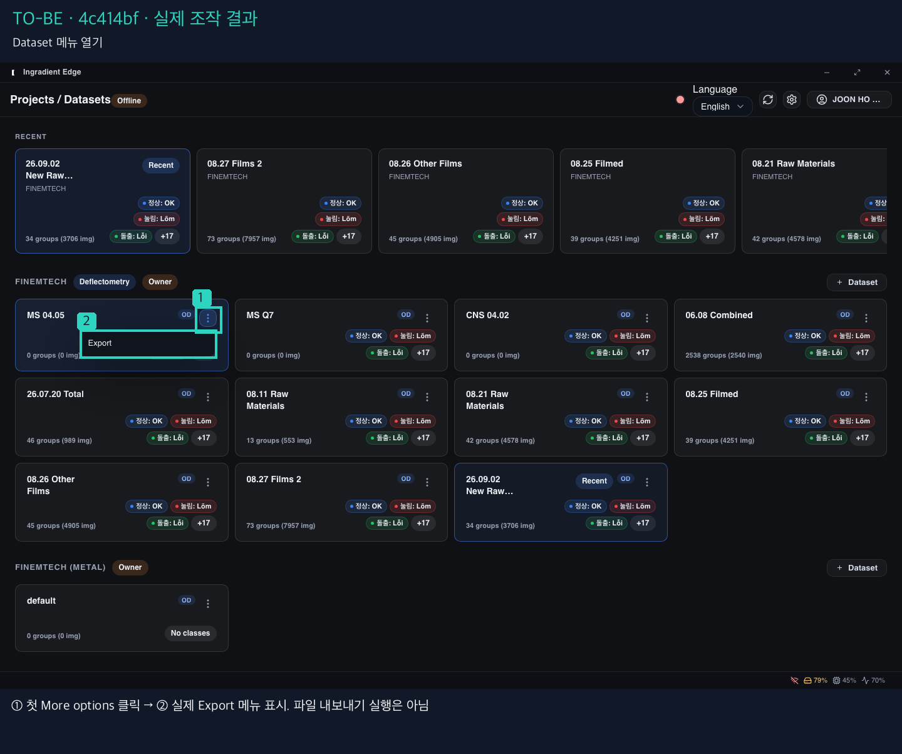
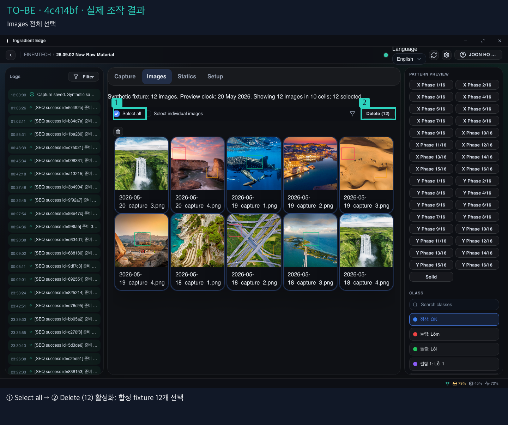
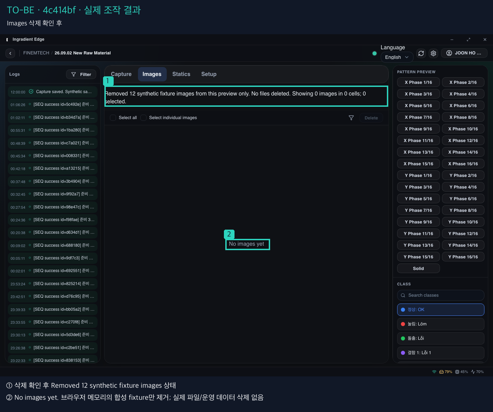
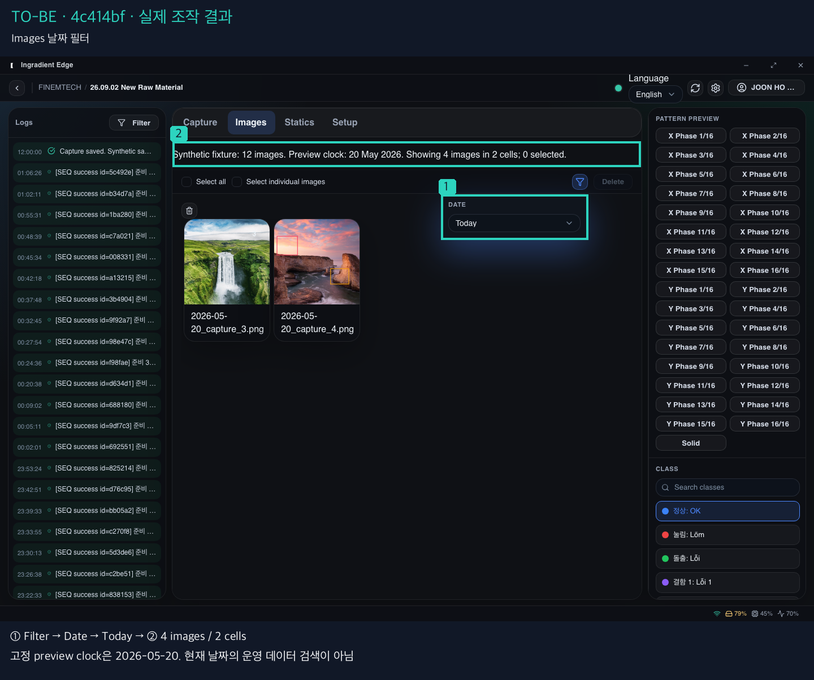
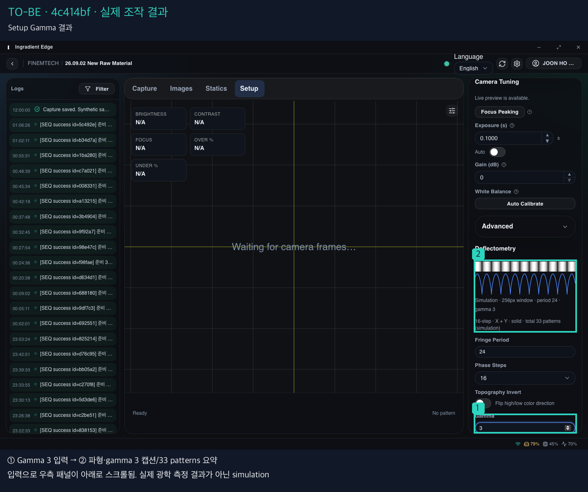
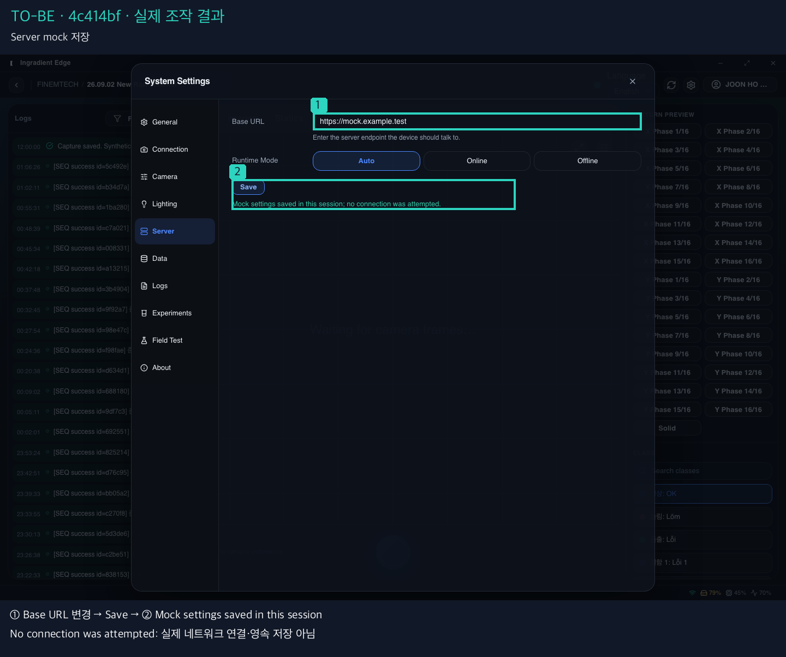
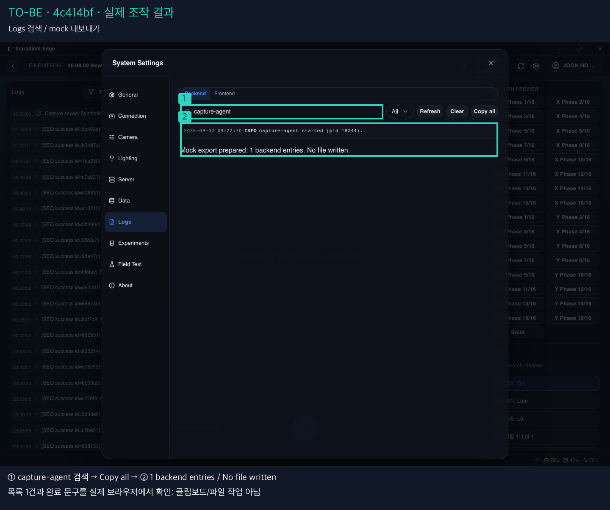

# Edge 이전 pull → 최신 main: AS-IS / TO-BE 이미지 비교

## 1. 비교 기준

| 항목 | 기준 |
|---|---|
| AS-IS | `c2b2606`: 당시 phase0 원본 캡처. 이전 코드를 이번에 다시 실행한 결과가 아님 |
| TO-BE | `4c414bf` (UI 구현 `4a85c21`): primary checkout의 Storybook **6015**에서 새로 캡처 |
| 범위 | 10개 전후 패널 + 7개 조작 결과 이미지. 화면 속 번호·사각형과 아래 설명이 대응 |
| 크기 | 기본 1440×1000, 좁은 화면은 양쪽 모두 **768×800**. 원본 픽셀/비율 유지 |
| 조건 | Edge 기본 dark/preset/density, 새 browser context. theme/density override 없음 |

**주황 = AS-IS, 청록 = TO-BE.** 아래 합성 이미지를 클릭하거나 개별 확대 링크를 열면 작은 컨트롤도 원래 해상도로 볼 수 있다. 표시 박스는 변경 부위/동작 대상이며 자동 pixel-diff가 아니다. 다른 날짜의 fixture·로그 문구는 디자인 변경과 구분한다.

[전체 소스 diff](https://github.com/InGradient/ingradient-ui/compare/c2b2606...4c414bf) · [원본별 출처/viewport/상태 manifest](assets/2026-09-21-edge-comparison/comparison-manifest.json) · [실제 캡처/행동 기록](assets/2026-09-21-edge-comparison/fresh-captures.json)

baseline 근거: [기본 캡처](assets/2026-09-20-edge-phase0/capture-manifest.json), [Settings 캡처](assets/2026-09-20-edge-phase0/settings-manifest.json), [기존 감사 §12의 primary c2b2606 및 clean 768 기록](2026-09-20-edge-layer-audit-and-plan.ko.md). phase1 중간 이미지는 사용하지 않았다.

## 2. Settings 메뉴

[AS-IS 확대](assets/2026-09-21-edge-comparison/01-settings-menu-as-is.png) · [TO-BE 확대](assets/2026-09-21-edge-comparison/01-settings-menu-to-be.png) · [현재 Story](http://localhost:6015/?path=/story/pages-edge-0-0-5-workspace--settings)

- ① 선택 항목: 좌측 선 + 배경 → 공용 Settings 탭의 둥근 배경·아이콘 강조

## 3. General — 선택과 Preview 분리

[AS-IS 확대](assets/2026-09-21-edge-comparison/02-general-as-is.png) · [TO-BE 확대](assets/2026-09-21-edge-comparison/02-general-to-be.png) · [현재 Story](http://localhost:6015/?path=/story/pages-edge-0-0-5-workspace--settings)

- ① Preview가 항목명 옆에서 행 오른쪽으로 이동; 선택과 재생 액션 분리
- ② 선택된 음색의 글자·배경 강조. 초기 음색은 두 화면 모두 Two-tone alarm

## 4. Dataset 카드와 메뉴

[AS-IS 확대](assets/2026-09-21-edge-comparison/03-datasets-as-is.png) · [TO-BE 확대](assets/2026-09-21-edge-comparison/03-datasets-to-be.png) · [현재 Story](http://localhost:6015/?path=/story/pages-edge-0-0-5-datasetselect--offline)

- ① 가로 점 메뉴 → 세로 kebab / 공용 MenuIconButton. Export 메뉴는 아래 동작 증거
- ② 일반 카드의 선택 버튼과 메뉴 버튼 분리. 키보드 계약은 소스/기존 검증 기록 근거

## 5. Images — 선택·필터·삭제

[AS-IS 확대](assets/2026-09-21-edge-comparison/04-images-as-is.png) · [TO-BE 확대](assets/2026-09-21-edge-comparison/04-images-to-be.png) · [현재 Story](http://localhost:6015/?path=/story/pages-edge-0-0-5-workspace--images)

- ① 선택/필터/삭제 컨트롤: local fixture 상태와 연결 (결과는 아래 실제 조작 캡처)
- ② 데이터 fixture가 다름: 최신 12개 합성 이미지/10셀. 운영 이미지 삭제 전후가 아님

## 6. Capture와 header

[AS-IS 확대](assets/2026-09-21-edge-comparison/05-capture-as-is.png) · [TO-BE 확대](assets/2026-09-21-edge-comparison/05-capture-to-be.png) · [현재 Story](http://localhost:6015/?path=/story/pages-edge-0-0-5-workspace--capture)

- ① EN 표시 → 이름이 있는 Language 선택 컨트롤; 전체 번역 완료를 뜻하지 않음
- ② 빈 격자 → Waiting for camera frames 안내. 실제 장비 연결/촬영 증거가 아님

## 7. 768px constrained desktop

[AS-IS 확대](assets/2026-09-21-edge-comparison/06-capture-768-as-is.png) · [TO-BE 확대](assets/2026-09-21-edge-comparison/06-capture-768-to-be.png) · [현재 Story](http://localhost:6015/?path=/story/pages-edge-0-0-5-workspace--capture)

- ① 잘린 탭/중앙 폭 160px → 중앙 최소폭 640px 및 수평 스크롤 정책
- ② 촬영 버튼의 중앙 위치 유지. 좌우 패널은 화면 밖에 존재; 모바일 재배치가 아님

## 8. Setup — 파생 미리보기

[AS-IS 확대](assets/2026-09-21-edge-comparison/07-setup-as-is.png) · [TO-BE 확대](assets/2026-09-21-edge-comparison/07-setup-to-be.png) · [현재 Story](http://localhost:6015/?path=/story/pages-edge-0-0-5-workspace--setup)

- ① fringe 미리보기·설명에 simulation 명시. Gamma 변경 시 파형/요약 갱신은 아래 결과
- 초기 상태끼리 비교. Gamma=3 결과는 우측 패널이 입력 위치로 스크롤된 별도 캡처

## 9. Settings 장치 설정 — Server

[AS-IS 확대](assets/2026-09-21-edge-comparison/08-server-as-is.png) · [TO-BE 확대](assets/2026-09-21-edge-comparison/08-server-to-be.png) · [현재 Story](http://localhost:6015/?path=/story/pages-edge-0-0-5-workspace--settings)

- ① Base URL / Runtime mode: 외형보다 편집·검증·세션 상태 연결이 핵심
- ② Save 결과는 아래 mock 저장 문구로 확인. 서버 접속이나 영속 저장을 수행하지 않음

## 10. Settings Logs — 검색과 결과

[AS-IS 확대](assets/2026-09-21-edge-comparison/09-logs-as-is.png) · [TO-BE 확대](assets/2026-09-21-edge-comparison/09-logs-to-be.png) · [현재 Story](http://localhost:6015/?path=/story/pages-edge-0-0-5-workspace--settings)

- ① 검색/level/source/작업 버튼을 fixture 상태에 연결
- ② 고정 높이 목록 → 내용 높이 및 mock 상태 표시. 검색 1건/내보내기 결과는 아래 증거

## 11. 신규 PS 분기 — 미도달에서 named Story로

[AS-IS 확대](assets/2026-09-21-edge-comparison/10-lighting-ps-as-is.png) · [TO-BE 확대](assets/2026-09-21-edge-comparison/10-lighting-ps-to-be.png) · [현재 Story](http://localhost:6015/?path=/story/pages-edge-0-0-5-settingsworkflows--lighting-ps)

- ① AS-IS는 기존 Lighting 진입면(모니터 선택). PS는 당시 미도달 — 옛 PS 화면을 만든 것이 아님
- TO-BE는 실제 LightingPs Story에서 All on 후 4채널 켜짐. 같은 상태의 픽셀 비교가 아님

## 12. 기능 변경 — 실제 조작 결과

아래는 최신 화면에서 짧게 조작하고 결과를 기다린 캡처다. baseline의 미동작 판정은 [당시 기록 §5·§12](2026-09-20-edge-layer-audit-and-plan.ko.md)과 소스 근거이며 이번 baseline 재실행 주장이 아니다.

### Dataset 메뉴 열기

- ① 첫 More options 클릭 → ② 실제 Export 메뉴 표시. 파일 내보내기 실행은 아님

### Images 전체 선택

- ① Select all → ② Delete (12) 활성화; 합성 fixture 12개 선택

### Images 삭제 확인 후

- ① 삭제 확인 후 Removed 12 synthetic fixture images 상태
- ② No images yet. 브라우저 메모리의 합성 fixture만 제거; 실제 파일/운영 데이터 삭제 없음

### Images 날짜 필터

- ① Filter → Date → Today → ② 4 images / 2 cells
- 고정 preview clock은 2026-05-20. 현재 날짜의 운영 데이터 검색이 아님

### Setup Gamma 결과

- ① Gamma 3 입력 → ② 파형·gamma 3 캡션/33 patterns 요약
- 입력으로 우측 패널이 아래로 스크롤됨. 실제 광학 측정 결과가 아닌 simulation

### Server mock 저장

- ① Base URL 변경 → Save → ② Mock settings saved in this session
- No connection was attempted: 실제 네트워크 연결·영속 저장 아님

### Logs 검색 / mock 내보내기

- ① capture-agent 검색 → Copy all → ② 1 backend entries / No file written
- 목록 1건과 완료 문구를 실제 브라우저에서 확인; 클립보드/파일 작업 아님

## 13. 확인 범위와 한계

- primary 경로 `/home/homebodify/Projects/ingradient-ui`, HEAD `4c414bf`, 6015 listener PID 79855의 cwd를 확인했다. 6016/worktree 화면은 사용하지 않았다. 새 worktree·의존성 설치·UI 소스 변경·commit/push 없음.
- fresh 원본 17개, 전후 패널 10개, 추가 동작 결과 7개. 기존 캡처는 수정하지 않고 사본 위에 Pillow/Apple SD Gothic Neo로 번호·범례를 합성했다. 원본 이미지 비율과 픽셀 크기를 유지했다.
- readiness는 실제 컨트롤/문구·font ready·Images img.complete로 확인했다. 768은 중앙 최소폭을 지키는 desktop scroll 정책이며 화면 밖 패널이 사라진 것이 아니다.
- PS는 기존 모니터 선택 진입면과 신규 named Story의 비교다. 기존 UI 안에서 같은 버튼을 눌러 동일 모달로 간 전후 비교가 아니다. Export/system/inspector의 모든 신규 분기를 이번 10쌍에 담지는 않았다.
- 최초 [MCP preview 응답](assets/2026-09-21-edge-comparison/mcp-preview.json)은 인자 schema 오류였다. 이후 `stories: [{ storyId }]` 형식으로 수정하여 비교 대상 6개 route의 [공식 preview 링크 확인에 성공](assets/2026-09-21-edge-comparison/mcp-preview-corrected.json)했다. 각 절의 현재 Story 링크가 그 주소다. 실제 이미지는 Playwright로 캡처했으며 전체 regression/a11y 테스트를 새로 수행했다는 뜻은 아니다.
- 캡처 과정의 숨은 checkbox visibility 및 빈 화면 문구 selector 오류는 수정 후 재실행했다. 최종 이미지 생성은 완료했지만 full regression/a11y/device integration 검증을 새로 실행한 것은 아니다.
- 기능은 Storybook의 세션 한정 simulation. 실제 카메라·조명·서버·OS·파일·production 데이터 작업은 검증하지 않았다. 테마/폰트/fixture 차이 때문에 자동 pixel regression baseline으로 사용하면 안 된다.

재현 코드: [capture](assets/2026-09-21-edge-comparison/capture.cjs), [추가 menu/filter/768](assets/2026-09-21-edge-comparison/supplement.cjs), [Images 로딩 완료](assets/2026-09-21-edge-comparison/images-ready.cjs), [주석·manifest 생성](assets/2026-09-21-edge-comparison/render.py).
